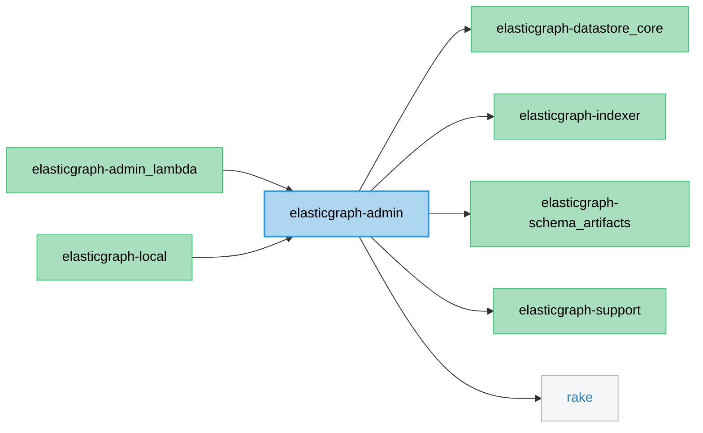

# ElasticGraph::Admin

Provides datastore administrative tasks for ElasticGraph.

## Dependency Diagram

```mermaid
graph LR;
    classDef currentGemStyle fill:#AED6F1,stroke:#3498DB,color:#000,stroke-width:2px;
    classDef internalEgGemStyle fill:#A9DFBF,stroke:#2ECC71,color:#000;
    classDef externalGemStyle fill:#F4F6F7,stroke:#B3B6B7,color:#2980B9;
    elasticgraph-admin["elasticgraph-admin"];
    class elasticgraph-admin currentGemStyle;
    elasticgraph-datastore_core["elasticgraph-datastore_core"];
    elasticgraph-admin --> elasticgraph-datastore_core;
    class elasticgraph-datastore_core internalEgGemStyle;
    elasticgraph-indexer["elasticgraph-indexer"];
    elasticgraph-admin --> elasticgraph-indexer;
    class elasticgraph-indexer internalEgGemStyle;
    elasticgraph-schema_artifacts["elasticgraph-schema_artifacts"];
    elasticgraph-admin --> elasticgraph-schema_artifacts;
    class elasticgraph-schema_artifacts internalEgGemStyle;
    elasticgraph-support["elasticgraph-support"];
    elasticgraph-admin --> elasticgraph-support;
    class elasticgraph-support internalEgGemStyle;
    rake["rake"];
    elasticgraph-admin --> rake;
    class rake externalGemStyle;
    elasticgraph-admin_lambda["elasticgraph-admin_lambda"];
    elasticgraph-admin_lambda --> elasticgraph-admin;
    class elasticgraph-admin_lambda internalEgGemStyle;
    elasticgraph-local["elasticgraph-local"];
    elasticgraph-local --> elasticgraph-admin;
    class elasticgraph-local internalEgGemStyle;
    click rake href "https://rubygems.org/gems/rake" "Open on RubyGems.org" _blank;
```
