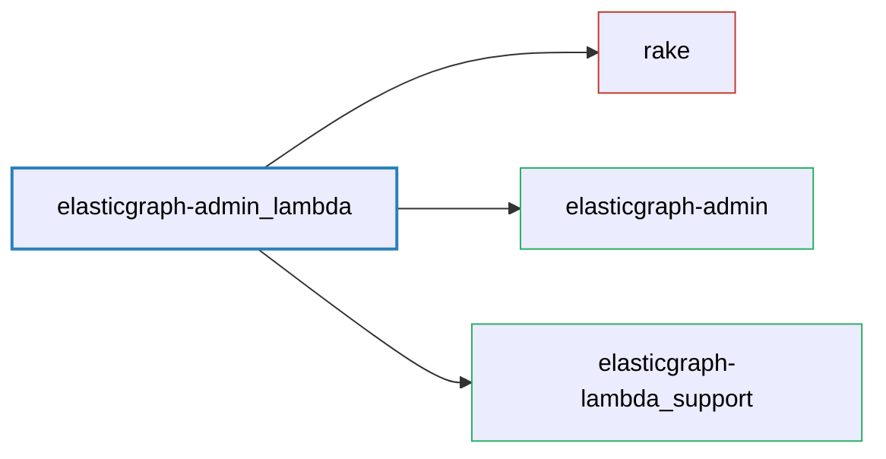

# ElasticGraph::AdminLambda

This gem wraps `elasticgraph-admin` in order to run it from an AWS Lambda.

## Dependency Diagram

```mermaid
graph LR;
    elasticgraph-admin_lambda["elasticgraph-admin_lambda"];
    rake["rake"];
    elasticgraph-admin_lambda --> rake;
    elasticgraph-admin["elasticgraph-admin"];
    elasticgraph-admin_lambda --> elasticgraph-admin;
    elasticgraph-lambda_support["elasticgraph-lambda_support"];
    elasticgraph-admin_lambda --> elasticgraph-lambda_support;
    style elasticgraph-admin_lambda fill:#lightblue,stroke:#2980b9,stroke-width:2px,color:#000;
    style rake fill:#lightcoral,stroke:#c0392b,stroke-width:1px,color:#000;
    style elasticgraph-admin fill:#lightgreen,stroke:#27ae60,stroke-width:1px,color:#000;
    style elasticgraph-lambda_support fill:#lightgreen,stroke:#27ae60,stroke-width:1px,color:#000;
```
