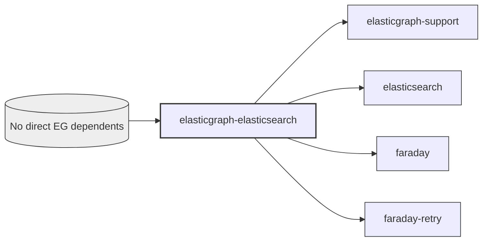

# ElasticGraph::Elasticsearch

Wraps the official Elasticsearch client for use by ElasticGraph.

## Dependency Diagram

```mermaid
graph LR;
    elasticgraph-elasticsearch --> elasticgraph-support;
    elasticgraph-elasticsearch --> elasticsearch;
    elasticgraph-elasticsearch --> faraday;
    elasticgraph-elasticsearch --> faraday-retry;
    no_eg_dependents[(No direct EG dependents)] --> elasticgraph-elasticsearch;
    classDef currentGemStyle fill:#lightblue,stroke:#333,stroke-width:2px;
    classDef internalEgGemStyle fill:#lightgreen,stroke:#333,stroke-width:1px;
    classDef externalGemStyle fill:#lightcoral,stroke:#333,stroke-width:1px;
    classDef placeholderNodeStyle fill:#eee,stroke:#333,stroke-width:1px;
    class elasticgraph-elasticsearch currentGemStyle;
    class elasticgraph-support internalEgGemStyle;
    class elasticsearch externalGemStyle;
    class faraday externalGemStyle;
    class faraday-retry externalGemStyle;
    class no_eg_dependents placeholderNodeStyle;
```
