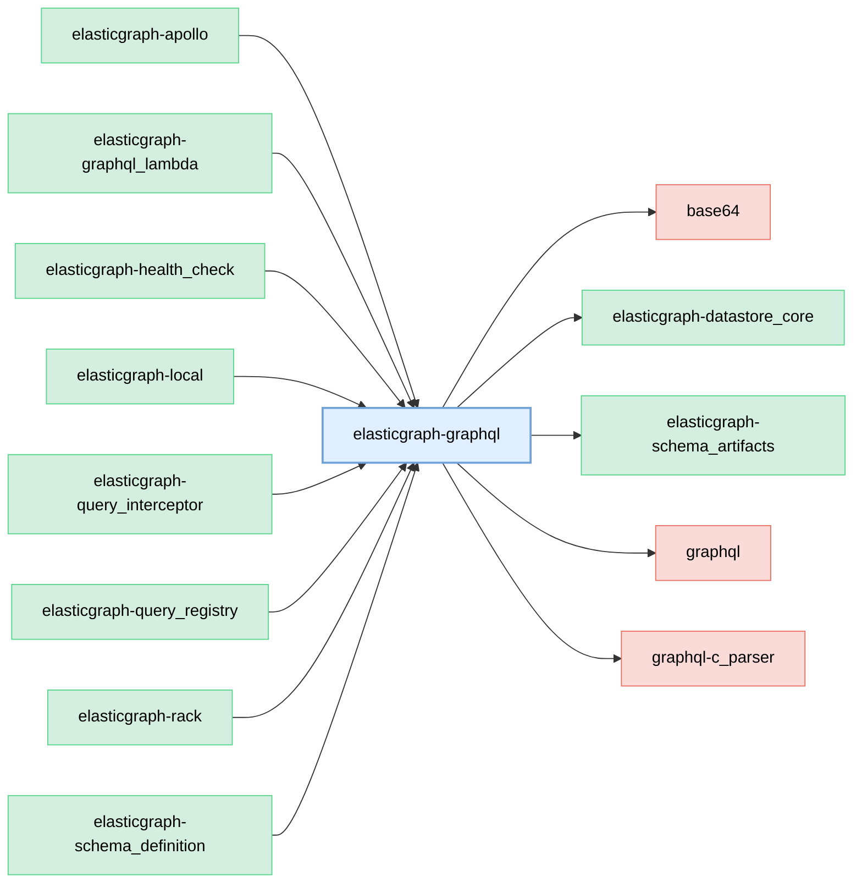

# ElasticGraph::GraphQL

Provides the ElasticGraph GraphQL query engine.

## Dependency Diagram

```mermaid
graph LR;
    classDef currentGemStyle fill:#E0EFFF,stroke:#70A1D7,color:#000,stroke-width:2px;
    classDef internalEgGemStyle fill:#D4EFDF,stroke:#58D68D,color:#000;
    classDef externalGemStyle fill:#FADBD8,stroke:#EC7063,color:#000;
    elasticgraph-graphql["elasticgraph-graphql"];
    class elasticgraph-graphql currentGemStyle;
    base64["base64"];
    elasticgraph-graphql --> base64;
    class base64 externalGemStyle;
    elasticgraph-datastore_core["elasticgraph-datastore_core"];
    elasticgraph-graphql --> elasticgraph-datastore_core;
    class elasticgraph-datastore_core internalEgGemStyle;
    elasticgraph-schema_artifacts["elasticgraph-schema_artifacts"];
    elasticgraph-graphql --> elasticgraph-schema_artifacts;
    class elasticgraph-schema_artifacts internalEgGemStyle;
    graphql["graphql"];
    elasticgraph-graphql --> graphql;
    class graphql externalGemStyle;
    graphql-c_parser["graphql-c_parser"];
    elasticgraph-graphql --> graphql-c_parser;
    class graphql-c_parser externalGemStyle;
    elasticgraph-apollo["elasticgraph-apollo"];
    elasticgraph-apollo --> elasticgraph-graphql;
    class elasticgraph-apollo internalEgGemStyle;
    elasticgraph-graphql_lambda["elasticgraph-graphql_lambda"];
    elasticgraph-graphql_lambda --> elasticgraph-graphql;
    class elasticgraph-graphql_lambda internalEgGemStyle;
    elasticgraph-health_check["elasticgraph-health_check"];
    elasticgraph-health_check --> elasticgraph-graphql;
    class elasticgraph-health_check internalEgGemStyle;
    elasticgraph-local["elasticgraph-local"];
    elasticgraph-local --> elasticgraph-graphql;
    class elasticgraph-local internalEgGemStyle;
    elasticgraph-query_interceptor["elasticgraph-query_interceptor"];
    elasticgraph-query_interceptor --> elasticgraph-graphql;
    class elasticgraph-query_interceptor internalEgGemStyle;
    elasticgraph-query_registry["elasticgraph-query_registry"];
    elasticgraph-query_registry --> elasticgraph-graphql;
    class elasticgraph-query_registry internalEgGemStyle;
    elasticgraph-rack["elasticgraph-rack"];
    elasticgraph-rack --> elasticgraph-graphql;
    class elasticgraph-rack internalEgGemStyle;
    elasticgraph-schema_definition["elasticgraph-schema_definition"];
    elasticgraph-schema_definition --> elasticgraph-graphql;
    class elasticgraph-schema_definition internalEgGemStyle;
    click base64 href "https://rubygems.org/gems/base64" "Open on RubyGems.org" _blank;
    click graphql href "https://rubygems.org/gems/graphql" "Open on RubyGems.org" _blank;
    click graphql-c_parser href "https://rubygems.org/gems/graphql-c_parser" "Open on RubyGems.org" _blank;
```
