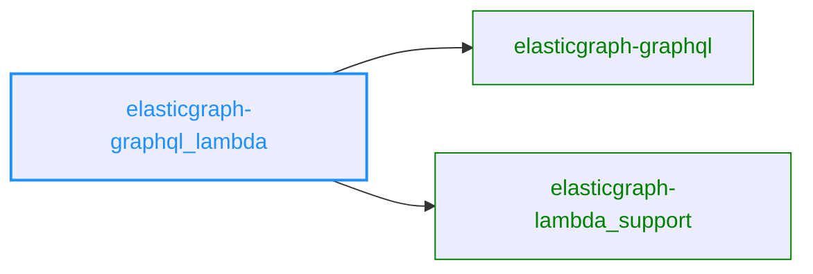

# ElasticGraph::GraphQLLambda

This gem wraps `elasticgraph-graphql` in order to run it from an AWS Lambda.

## Dependency Diagram

```mermaid
graph LR;
    elasticgraph-graphql_lambda["elasticgraph-graphql_lambda"];
    elasticgraph-graphql["elasticgraph-graphql"];
    elasticgraph-graphql_lambda --> elasticgraph-graphql;
    elasticgraph-lambda_support["elasticgraph-lambda_support"];
    elasticgraph-graphql_lambda --> elasticgraph-lambda_support;
    style elasticgraph-graphql_lambda color:DodgerBlue,stroke-width:2px,stroke:DodgerBlue;
    style elasticgraph-graphql color:Green,stroke:Green;
    style elasticgraph-lambda_support color:Green,stroke:Green;
```
