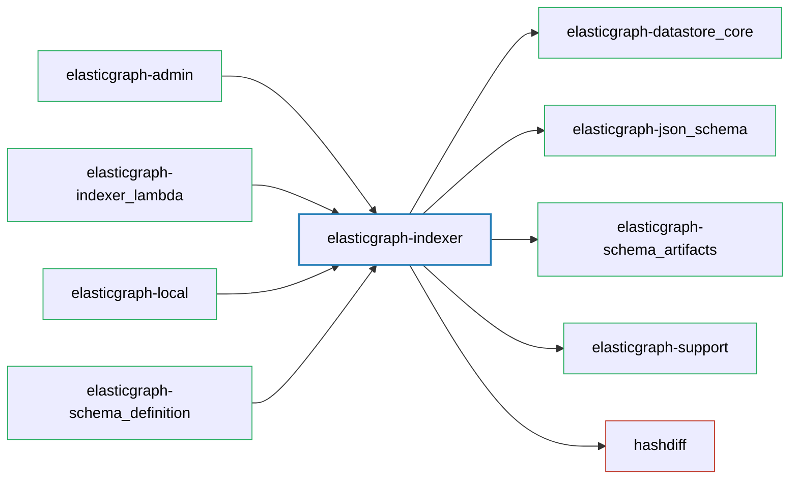

# ElasticGraph::Indexer
## Dependency Diagram

```mermaid
graph LR;
    elasticgraph-indexer["elasticgraph-indexer"];
    elasticgraph-datastore_core["elasticgraph-datastore_core"];
    elasticgraph-indexer --> elasticgraph-datastore_core;
    elasticgraph-json_schema["elasticgraph-json_schema"];
    elasticgraph-indexer --> elasticgraph-json_schema;
    elasticgraph-schema_artifacts["elasticgraph-schema_artifacts"];
    elasticgraph-indexer --> elasticgraph-schema_artifacts;
    elasticgraph-support["elasticgraph-support"];
    elasticgraph-indexer --> elasticgraph-support;
    hashdiff["hashdiff"];
    elasticgraph-indexer --> hashdiff;
    elasticgraph-admin["elasticgraph-admin"];
    elasticgraph-admin --> elasticgraph-indexer;
    elasticgraph-indexer_lambda["elasticgraph-indexer_lambda"];
    elasticgraph-indexer_lambda --> elasticgraph-indexer;
    elasticgraph-local["elasticgraph-local"];
    elasticgraph-local --> elasticgraph-indexer;
    elasticgraph-schema_definition["elasticgraph-schema_definition"];
    elasticgraph-schema_definition --> elasticgraph-indexer;
    style elasticgraph-indexer fill:#lightblue,stroke:#2980b9,stroke-width:2px,color:#000;
    style elasticgraph-datastore_core fill:#lightgreen,stroke:#27ae60,stroke-width:1px,color:#000;
    style elasticgraph-json_schema fill:#lightgreen,stroke:#27ae60,stroke-width:1px,color:#000;
    style elasticgraph-schema_artifacts fill:#lightgreen,stroke:#27ae60,stroke-width:1px,color:#000;
    style elasticgraph-support fill:#lightgreen,stroke:#27ae60,stroke-width:1px,color:#000;
    style hashdiff fill:#lightcoral,stroke:#c0392b,stroke-width:1px,color:#000;
    style elasticgraph-admin fill:#lightgreen,stroke:#27ae60,stroke-width:1px,color:#000;
    style elasticgraph-indexer_lambda fill:#lightgreen,stroke:#27ae60,stroke-width:1px,color:#000;
    style elasticgraph-local fill:#lightgreen,stroke:#27ae60,stroke-width:1px,color:#000;
    style elasticgraph-schema_definition fill:#lightgreen,stroke:#27ae60,stroke-width:1px,color:#000;
```
