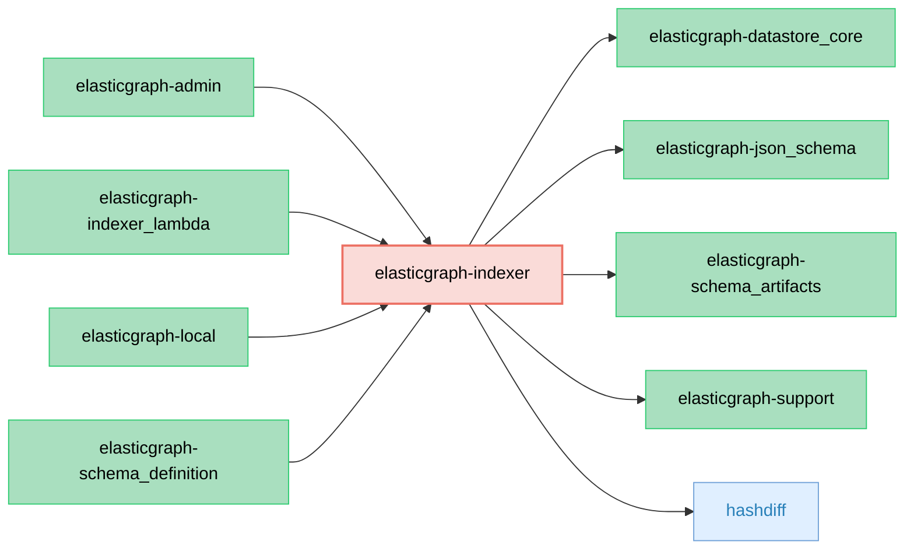

# ElasticGraph::Indexer
## Dependency Diagram

```mermaid
graph LR;
    classDef currentGemStyle fill:#FADBD8,stroke:#EC7063,color:#000,stroke-width:2px;
    classDef internalEgGemStyle fill:#A9DFBF,stroke:#2ECC71,color:#000;
    classDef externalGemStyle fill:#E0EFFF,stroke:#70A1D7,color:#2980B9;
    elasticgraph-indexer["elasticgraph-indexer"];
    class elasticgraph-indexer currentGemStyle;
    elasticgraph-datastore_core["elasticgraph-datastore_core"];
    elasticgraph-indexer --> elasticgraph-datastore_core;
    class elasticgraph-datastore_core internalEgGemStyle;
    elasticgraph-json_schema["elasticgraph-json_schema"];
    elasticgraph-indexer --> elasticgraph-json_schema;
    class elasticgraph-json_schema internalEgGemStyle;
    elasticgraph-schema_artifacts["elasticgraph-schema_artifacts"];
    elasticgraph-indexer --> elasticgraph-schema_artifacts;
    class elasticgraph-schema_artifacts internalEgGemStyle;
    elasticgraph-support["elasticgraph-support"];
    elasticgraph-indexer --> elasticgraph-support;
    class elasticgraph-support internalEgGemStyle;
    hashdiff["hashdiff"];
    elasticgraph-indexer --> hashdiff;
    class hashdiff externalGemStyle;
    elasticgraph-admin["elasticgraph-admin"];
    elasticgraph-admin --> elasticgraph-indexer;
    class elasticgraph-admin internalEgGemStyle;
    elasticgraph-indexer_lambda["elasticgraph-indexer_lambda"];
    elasticgraph-indexer_lambda --> elasticgraph-indexer;
    class elasticgraph-indexer_lambda internalEgGemStyle;
    elasticgraph-local["elasticgraph-local"];
    elasticgraph-local --> elasticgraph-indexer;
    class elasticgraph-local internalEgGemStyle;
    elasticgraph-schema_definition["elasticgraph-schema_definition"];
    elasticgraph-schema_definition --> elasticgraph-indexer;
    class elasticgraph-schema_definition internalEgGemStyle;
    click hashdiff href "https://rubygems.org/gems/hashdiff" "Open on RubyGems.org" _blank;
```
