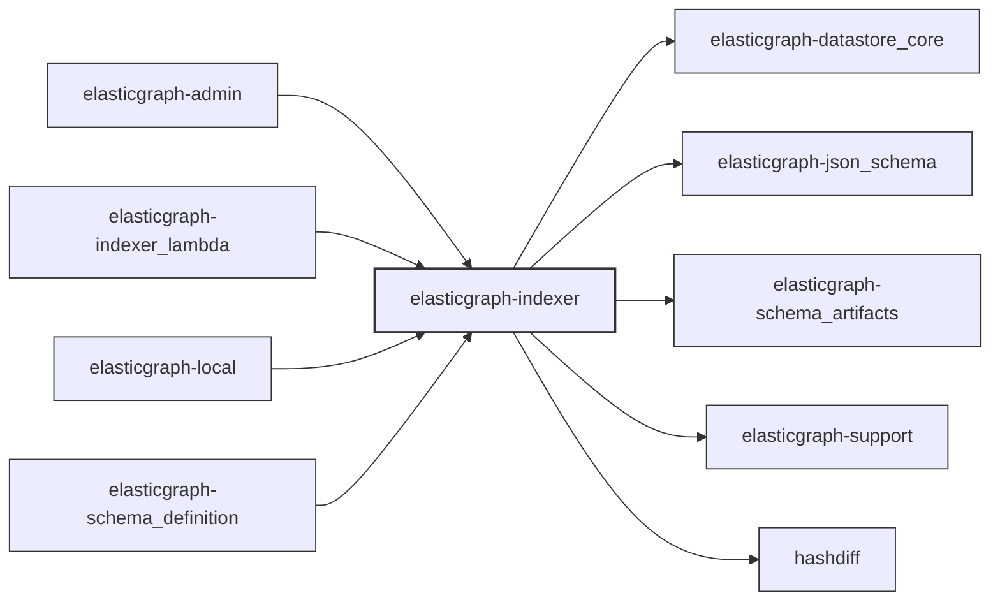

# ElasticGraph::Indexer
## Dependency Diagram

```mermaid
graph LR;
    elasticgraph-indexer --> elasticgraph-datastore_core;
    elasticgraph-indexer --> elasticgraph-json_schema;
    elasticgraph-indexer --> elasticgraph-schema_artifacts;
    elasticgraph-indexer --> elasticgraph-support;
    elasticgraph-indexer --> hashdiff;
    elasticgraph-admin --> elasticgraph-indexer;
    elasticgraph-indexer_lambda --> elasticgraph-indexer;
    elasticgraph-local --> elasticgraph-indexer;
    elasticgraph-schema_definition --> elasticgraph-indexer;
    classDef currentGemStyle fill:#lightblue,stroke:#333,stroke-width:2px;
    classDef internalEgGemStyle fill:#lightgreen,stroke:#333,stroke-width:1px;
    classDef externalGemStyle fill:#lightcoral,stroke:#333,stroke-width:1px;
    classDef placeholderNodeStyle fill:#eee,stroke:#333,stroke-width:1px;
    class elasticgraph-indexer currentGemStyle;
    class elasticgraph-datastore_core internalEgGemStyle;
    class elasticgraph-json_schema internalEgGemStyle;
    class elasticgraph-schema_artifacts internalEgGemStyle;
    class elasticgraph-support internalEgGemStyle;
    class hashdiff externalGemStyle;
    class elasticgraph-admin internalEgGemStyle;
    class elasticgraph-indexer_lambda internalEgGemStyle;
    class elasticgraph-local internalEgGemStyle;
    class elasticgraph-schema_definition internalEgGemStyle;
```
