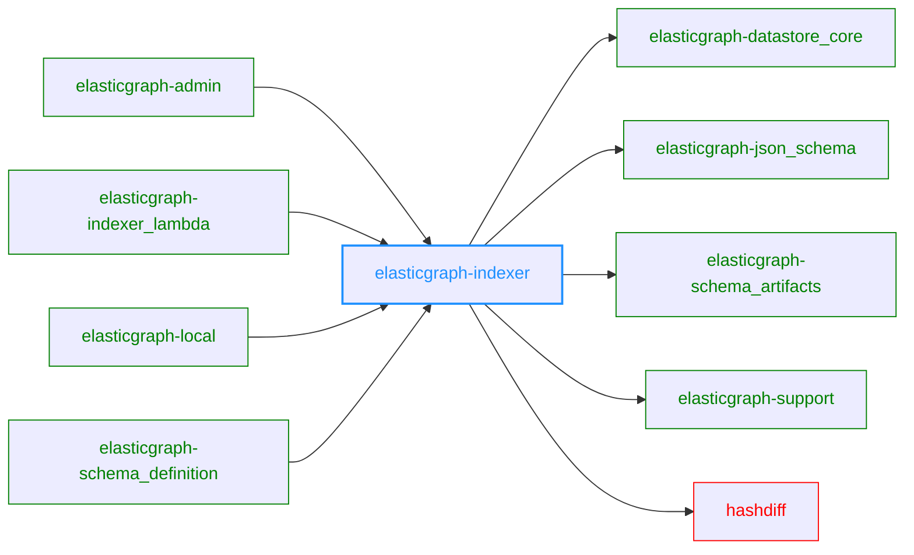

# ElasticGraph::Indexer
## Dependency Diagram

```mermaid
graph LR;
    elasticgraph-indexer["elasticgraph-indexer"];
    elasticgraph-datastore_core["elasticgraph-datastore_core"];
    elasticgraph-indexer --> elasticgraph-datastore_core;
    elasticgraph-json_schema["elasticgraph-json_schema"];
    elasticgraph-indexer --> elasticgraph-json_schema;
    elasticgraph-schema_artifacts["elasticgraph-schema_artifacts"];
    elasticgraph-indexer --> elasticgraph-schema_artifacts;
    elasticgraph-support["elasticgraph-support"];
    elasticgraph-indexer --> elasticgraph-support;
    hashdiff["hashdiff"];
    elasticgraph-indexer --> hashdiff;
    elasticgraph-admin["elasticgraph-admin"];
    elasticgraph-admin --> elasticgraph-indexer;
    elasticgraph-indexer_lambda["elasticgraph-indexer_lambda"];
    elasticgraph-indexer_lambda --> elasticgraph-indexer;
    elasticgraph-local["elasticgraph-local"];
    elasticgraph-local --> elasticgraph-indexer;
    elasticgraph-schema_definition["elasticgraph-schema_definition"];
    elasticgraph-schema_definition --> elasticgraph-indexer;
    style elasticgraph-indexer color:DodgerBlue,stroke-width:2px,stroke:DodgerBlue;
    style elasticgraph-datastore_core color:Green,stroke:Green;
    style elasticgraph-json_schema color:Green,stroke:Green;
    style elasticgraph-schema_artifacts color:Green,stroke:Green;
    style elasticgraph-support color:Green,stroke:Green;
    style hashdiff color:Red,stroke:Red;
    style elasticgraph-admin color:Green,stroke:Green;
    style elasticgraph-indexer_lambda color:Green,stroke:Green;
    style elasticgraph-local color:Green,stroke:Green;
    style elasticgraph-schema_definition color:Green,stroke:Green;
    click hashdiff href "https://rubygems.org/gems/hashdiff" "Open on RubyGems.org" _blank;
```
