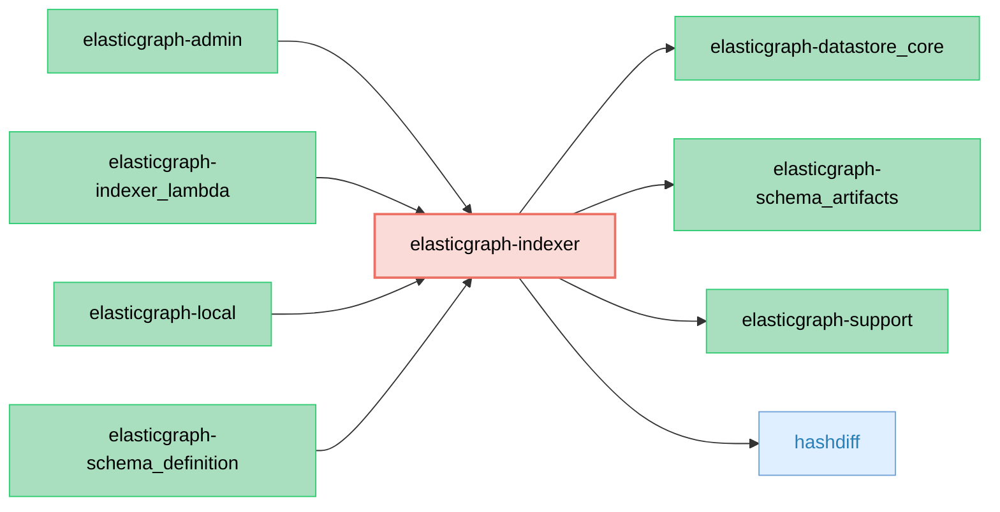

# ElasticGraph::Indexer

ElasticGraph gem that provides APIs to robustly index data into a datastore.

## Dependency Diagram



## Usage

```ruby
require "elastic_graph/indexer"

indexer = ElasticGraph::Indexer.from_yaml_file("config/settings/local.yaml")

events = [] # JSON events read from an async datastream
indexer.processor.process(events)
```

## Custom Payload Decoding

`ElasticGraph::Indexer` can be configured with an indexing event decoder extension. Decoders turn raw payload strings
from a transport into ElasticGraph indexing event hashes before the normal validation and indexing pipeline runs. The
default decoder expects JSON Lines.

```yaml
indexer:
  indexing_event_decoder:
    name: MyCompany::ElasticGraph::CSVIndexingEventDecoder
    require_path: ./lib/my_company/elastic_graph/csv_indexing_event_decoder
    config:
      delimiter: ","
```

Decoder extensions must implement this interface:

```ruby
# lib/my_company/elastic_graph/csv_indexing_event_decoder.rb
module MyCompany
  module ElasticGraph
    class CSVIndexingEventDecoder
      def initialize(config:, schema_artifacts:, logger:)
        # `config` is a hash containing parameterized configuration values from the
        # `indexing_event_decoder.config` setting (see above for an example).
        #
        # `schema_artifacts` provides access to the schema artifacts, in case decoding
        # depends on the schema.
        #
        # `logger` is the ElasticGraph logger.
      end

      def decode(payload)
        # Must return an array of ElasticGraph indexing event hashes.
      end
    end
  end
end
```
