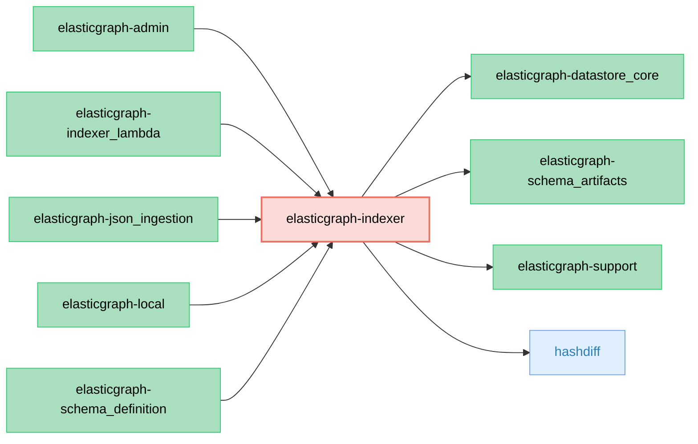

# ElasticGraph::Indexer

ElasticGraph gem that provides APIs to robustly index data into a datastore.

## Dependency Diagram


```mermaid
graph LR;
    classDef targetGemStyle fill:#FADBD8,stroke:#EC7063,color:#000,stroke-width:2px;
    classDef otherEgGemStyle fill:#A9DFBF,stroke:#2ECC71,color:#000;
    classDef externalGemStyle fill:#E0EFFF,stroke:#70A1D7,color:#2980B9;
    elasticgraph-indexer["elasticgraph-indexer"];
    class elasticgraph-indexer targetGemStyle;
    elasticgraph-datastore_core["elasticgraph-datastore_core"];
    elasticgraph-indexer --> elasticgraph-datastore_core;
    class elasticgraph-datastore_core otherEgGemStyle;
    elasticgraph-schema_artifacts["elasticgraph-schema_artifacts"];
    elasticgraph-indexer --> elasticgraph-schema_artifacts;
    class elasticgraph-schema_artifacts otherEgGemStyle;
    elasticgraph-support["elasticgraph-support"];
    elasticgraph-indexer --> elasticgraph-support;
    class elasticgraph-support otherEgGemStyle;
    hashdiff["hashdiff"];
    elasticgraph-indexer --> hashdiff;
    class hashdiff externalGemStyle;
    elasticgraph-admin["elasticgraph-admin"];
    elasticgraph-admin --> elasticgraph-indexer;
    class elasticgraph-admin otherEgGemStyle;
    elasticgraph-indexer_lambda["elasticgraph-indexer_lambda"];
    elasticgraph-indexer_lambda --> elasticgraph-indexer;
    class elasticgraph-indexer_lambda otherEgGemStyle;
    elasticgraph-json_ingestion["elasticgraph-json_ingestion"];
    elasticgraph-json_ingestion --> elasticgraph-indexer;
    class elasticgraph-json_ingestion otherEgGemStyle;
    elasticgraph-local["elasticgraph-local"];
    elasticgraph-local --> elasticgraph-indexer;
    class elasticgraph-local otherEgGemStyle;
    elasticgraph-schema_definition["elasticgraph-schema_definition"];
    elasticgraph-schema_definition --> elasticgraph-indexer;
    class elasticgraph-schema_definition otherEgGemStyle;
    click hashdiff href "https://rubygems.org/gems/hashdiff" "Open on RubyGems.org" _blank;
```

## Usage

```ruby
require "elastic_graph/indexer"

indexer = ElasticGraph::Indexer.from_yaml_file("config/settings/local.yaml")

events = [] # JSON events read from an async datastream
indexer.processor.process(events)
```

## Ingestion schema versions

Each ingestion adapter owns its format's schema version requirements, validation, and record preparation.
The shared indexing pipeline does not require a schema version or translate format-specific version fields.
JSON publishers must continue to provide `json_schema_version`; the JSON adapter selects the appropriate
JSON schema and record preparer. Other formats need not adopt JSON's versioning scheme.

`ElasticGraphIndexingLatencies` logs identify events by type, ID, event version, and message ID;
they no longer include `json_schema_version`. JSON version fallback diagnostics remain in
`ElasticGraphMissingJSONSchemaVersion` logs emitted by the JSON adapter.
