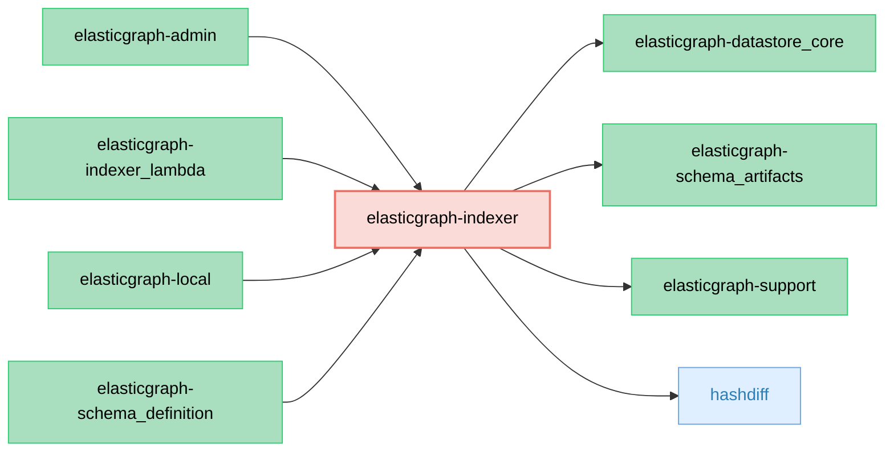

# ElasticGraph::Indexer

ElasticGraph gem that provides APIs to robustly index data into a datastore.

## Dependency Diagram


```mermaid
graph LR;
    classDef targetGemStyle fill:#FADBD8,stroke:#EC7063,color:#000,stroke-width:2px;
    classDef otherEgGemStyle fill:#A9DFBF,stroke:#2ECC71,color:#000;
    classDef externalGemStyle fill:#E0EFFF,stroke:#70A1D7,color:#2980B9;
    elasticgraph-indexer["elasticgraph-indexer"];
    class elasticgraph-indexer targetGemStyle;
    elasticgraph-datastore_core["elasticgraph-datastore_core"];
    elasticgraph-indexer --> elasticgraph-datastore_core;
    class elasticgraph-datastore_core otherEgGemStyle;
    elasticgraph-schema_artifacts["elasticgraph-schema_artifacts"];
    elasticgraph-indexer --> elasticgraph-schema_artifacts;
    class elasticgraph-schema_artifacts otherEgGemStyle;
    elasticgraph-support["elasticgraph-support"];
    elasticgraph-indexer --> elasticgraph-support;
    class elasticgraph-support otherEgGemStyle;
    hashdiff["hashdiff"];
    elasticgraph-indexer --> hashdiff;
    class hashdiff externalGemStyle;
    elasticgraph-admin["elasticgraph-admin"];
    elasticgraph-admin --> elasticgraph-indexer;
    class elasticgraph-admin otherEgGemStyle;
    elasticgraph-indexer_lambda["elasticgraph-indexer_lambda"];
    elasticgraph-indexer_lambda --> elasticgraph-indexer;
    class elasticgraph-indexer_lambda otherEgGemStyle;
    elasticgraph-local["elasticgraph-local"];
    elasticgraph-local --> elasticgraph-indexer;
    class elasticgraph-local otherEgGemStyle;
    elasticgraph-schema_definition["elasticgraph-schema_definition"];
    elasticgraph-schema_definition --> elasticgraph-indexer;
    class elasticgraph-schema_definition otherEgGemStyle;
    click hashdiff href "https://rubygems.org/gems/hashdiff" "Open on RubyGems.org" _blank;
```

## Usage

```ruby
require "elastic_graph/indexer"

indexer = ElasticGraph::Indexer.from_yaml_file("config/settings/local.yaml")

events = [] # JSON events read from an async datastream
indexer.processor.process(events)
```

## Payload Decoding

Ingesting encoded payloads from a transport (such as the SQS lambdas) requires an indexing event decoder extension,
configured via the `indexer.indexing_event_decoder` setting. Decoders turn raw payload strings into ElasticGraph
indexing event hashes before the normal validation and indexing pipeline runs. Ingestion format gems provide decoder
implementations, or you can define your own:

```yaml
indexer:
  indexing_event_decoder:
    name: MyCompany::ElasticGraph::CSVIndexingEventDecoder
    require_path: ./lib/my_company/elastic_graph/csv_indexing_event_decoder
    config:
      delimiter: ","
```

Decoder extensions must implement this interface:

```ruby
# lib/my_company/elastic_graph/csv_indexing_event_decoder.rb
module MyCompany
  module ElasticGraph
    class CSVIndexingEventDecoder
      def initialize(config:, schema_artifacts:, logger:)
        # `config` is a hash containing parameterized configuration values from the
        # `indexing_event_decoder.config` setting (see above for an example).
        #
        # `schema_artifacts` provides access to the schema artifacts, in case decoding
        # depends on the schema.
        #
        # `logger` is the ElasticGraph logger.
      end

      def decode(payload)
        # Must return an array of ElasticGraph indexing event hashes.
      end
    end
  end
end
```

A decoded event hash may carry a `schema_version` to request a specific schema artifact version. The
key is optional, because an ingestion format may have no versions at all. Each ingestion adapter
decides what a missing version means for its own format. `elasticgraph-json_ingestion` uses the latest
available JSON schema version.

Decoders identify their format with an `ingestion_format` key (for example, `"json"`). Adapters use
that tag to route events independently of whether the format has schema versions. Untagged events
remain compatible with JSON callers; other formats must supply a tag. A sole adapter receives all
untagged events so it can provide detailed validation errors, but must still recognize an explicit tag.

A successful ingestion adapter result supplies both a record preparer and a normalized event through
`IngestionAdapter::ValidationResult.valid(record_preparer, event: normalized_event)`. The normalized
event must preserve the event's identity, record, and transport metadata without mutating the input.
For versioned formats, set `schema_version` to the artifact version actually selected for validation
and preparation. Formats without versions may omit it. Operations, latency logs, and warehouse
partitions use this normalized envelope.

See [the JSON ingestion upgrade guide](../elasticgraph-json_ingestion/README.md#upgrading-an-existing-json-deployment)
when upgrading an existing deployment.
