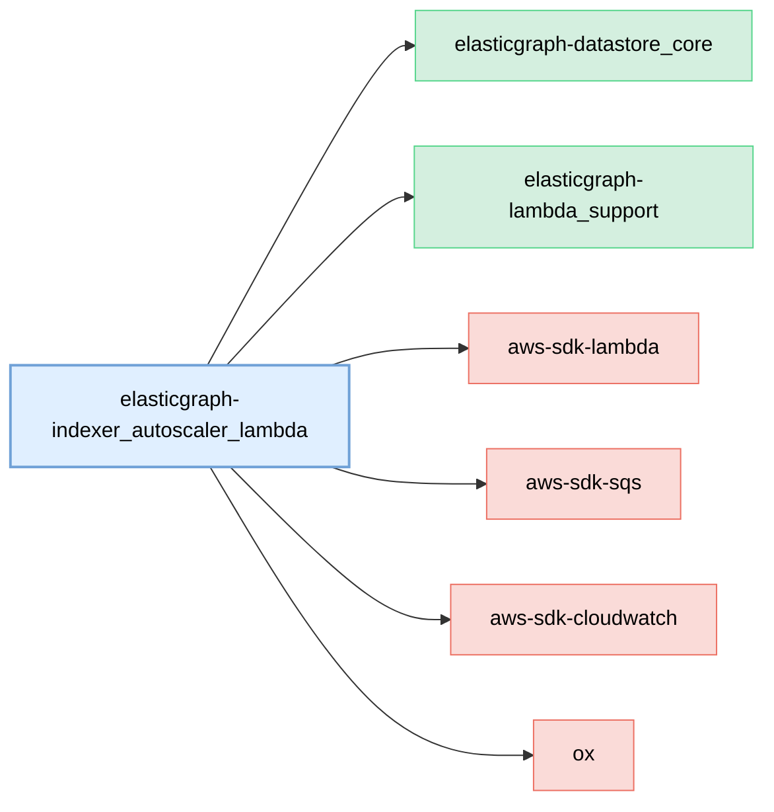

# ElasticGraph::IndexerAutoscalerLambda
## Dependency Diagram

```mermaid
graph LR;
    classDef currentGemStyle fill:#E0EFFF,stroke:#70A1D7,color:#000,stroke-width:2px;
    classDef internalEgGemStyle fill:#D4EFDF,stroke:#58D68D,color:#000;
    classDef externalGemStyle fill:#FADBD8,stroke:#EC7063,color:#000;
    elasticgraph-indexer_autoscaler_lambda["elasticgraph-indexer_autoscaler_lambda"];
    class elasticgraph-indexer_autoscaler_lambda currentGemStyle;
    elasticgraph-datastore_core["elasticgraph-datastore_core"];
    elasticgraph-indexer_autoscaler_lambda --> elasticgraph-datastore_core;
    class elasticgraph-datastore_core internalEgGemStyle;
    elasticgraph-lambda_support["elasticgraph-lambda_support"];
    elasticgraph-indexer_autoscaler_lambda --> elasticgraph-lambda_support;
    class elasticgraph-lambda_support internalEgGemStyle;
    aws-sdk-lambda["aws-sdk-lambda"];
    elasticgraph-indexer_autoscaler_lambda --> aws-sdk-lambda;
    class aws-sdk-lambda externalGemStyle;
    aws-sdk-sqs["aws-sdk-sqs"];
    elasticgraph-indexer_autoscaler_lambda --> aws-sdk-sqs;
    class aws-sdk-sqs externalGemStyle;
    aws-sdk-cloudwatch["aws-sdk-cloudwatch"];
    elasticgraph-indexer_autoscaler_lambda --> aws-sdk-cloudwatch;
    class aws-sdk-cloudwatch externalGemStyle;
    ox["ox"];
    elasticgraph-indexer_autoscaler_lambda --> ox;
    class ox externalGemStyle;
    click aws-sdk-lambda href "https://rubygems.org/gems/aws-sdk-lambda" "Open on RubyGems.org" _blank;
    click aws-sdk-sqs href "https://rubygems.org/gems/aws-sdk-sqs" "Open on RubyGems.org" _blank;
    click aws-sdk-cloudwatch href "https://rubygems.org/gems/aws-sdk-cloudwatch" "Open on RubyGems.org" _blank;
    click ox href "https://rubygems.org/gems/ox" "Open on RubyGems.org" _blank;
```
