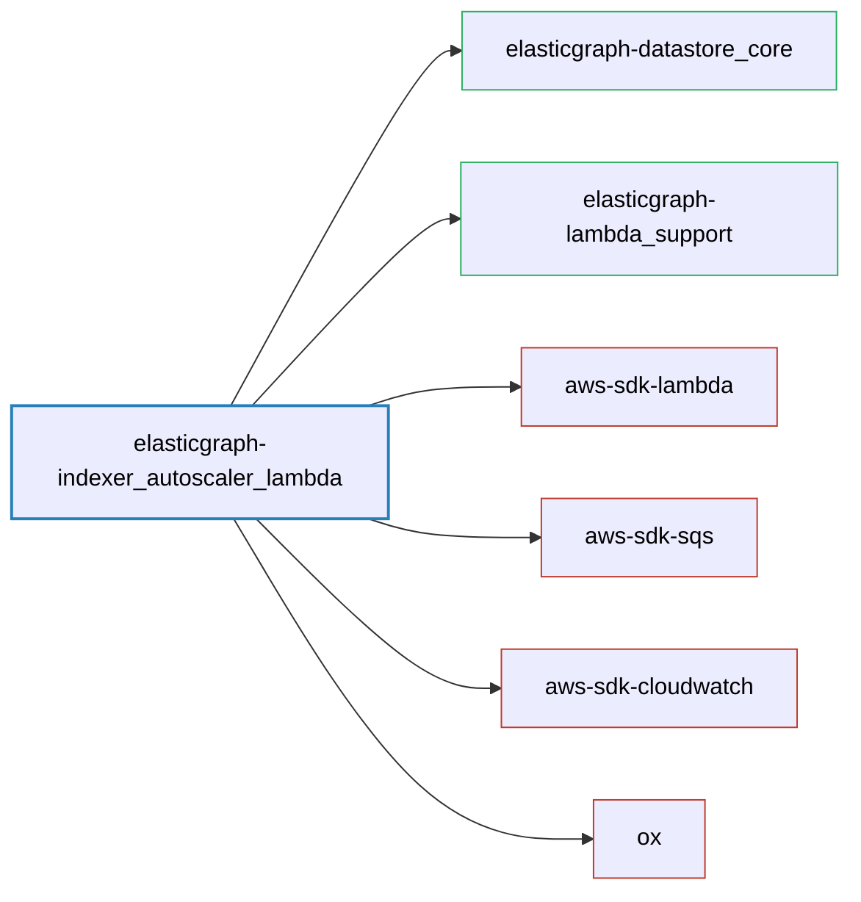

# ElasticGraph::IndexerAutoscalerLambda
## Dependency Diagram

```mermaid
graph LR;
    elasticgraph-indexer_autoscaler_lambda["elasticgraph-indexer_autoscaler_lambda"];
    elasticgraph-datastore_core["elasticgraph-datastore_core"];
    elasticgraph-indexer_autoscaler_lambda --> elasticgraph-datastore_core;
    elasticgraph-lambda_support["elasticgraph-lambda_support"];
    elasticgraph-indexer_autoscaler_lambda --> elasticgraph-lambda_support;
    aws-sdk-lambda["aws-sdk-lambda"];
    elasticgraph-indexer_autoscaler_lambda --> aws-sdk-lambda;
    aws-sdk-sqs["aws-sdk-sqs"];
    elasticgraph-indexer_autoscaler_lambda --> aws-sdk-sqs;
    aws-sdk-cloudwatch["aws-sdk-cloudwatch"];
    elasticgraph-indexer_autoscaler_lambda --> aws-sdk-cloudwatch;
    ox["ox"];
    elasticgraph-indexer_autoscaler_lambda --> ox;
    style elasticgraph-indexer_autoscaler_lambda fill:#lightblue,stroke:#2980b9,stroke-width:2px,color:#000;
    style elasticgraph-datastore_core fill:#lightgreen,stroke:#27ae60,stroke-width:1px,color:#000;
    style elasticgraph-lambda_support fill:#lightgreen,stroke:#27ae60,stroke-width:1px,color:#000;
    style aws-sdk-lambda fill:#lightcoral,stroke:#c0392b,stroke-width:1px,color:#000;
    style aws-sdk-sqs fill:#lightcoral,stroke:#c0392b,stroke-width:1px,color:#000;
    style aws-sdk-cloudwatch fill:#lightcoral,stroke:#c0392b,stroke-width:1px,color:#000;
    style ox fill:#lightcoral,stroke:#c0392b,stroke-width:1px,color:#000;
```
