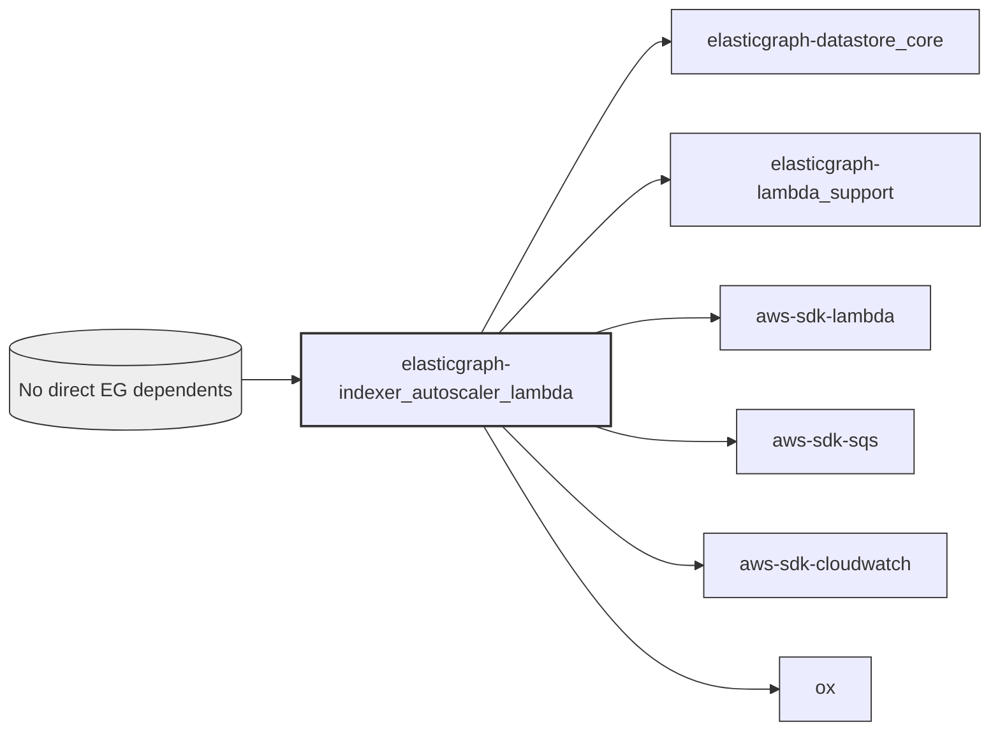

# ElasticGraph::IndexerAutoscalerLambda
## Dependency Diagram

```mermaid
graph LR;
    elasticgraph-indexer_autoscaler_lambda --> elasticgraph-datastore_core;
    elasticgraph-indexer_autoscaler_lambda --> elasticgraph-lambda_support;
    elasticgraph-indexer_autoscaler_lambda --> aws-sdk-lambda;
    elasticgraph-indexer_autoscaler_lambda --> aws-sdk-sqs;
    elasticgraph-indexer_autoscaler_lambda --> aws-sdk-cloudwatch;
    elasticgraph-indexer_autoscaler_lambda --> ox;
    no_eg_dependents[(No direct EG dependents)] --> elasticgraph-indexer_autoscaler_lambda;
    classDef currentGemStyle fill:#lightblue,stroke:#333,stroke-width:2px;
    classDef internalEgGemStyle fill:#lightgreen,stroke:#333,stroke-width:1px;
    classDef externalGemStyle fill:#lightcoral,stroke:#333,stroke-width:1px;
    classDef placeholderNodeStyle fill:#eee,stroke:#333,stroke-width:1px;
    class elasticgraph-indexer_autoscaler_lambda currentGemStyle;
    class elasticgraph-datastore_core internalEgGemStyle;
    class elasticgraph-lambda_support internalEgGemStyle;
    class aws-sdk-lambda externalGemStyle;
    class aws-sdk-sqs externalGemStyle;
    class aws-sdk-cloudwatch externalGemStyle;
    class ox externalGemStyle;
    class no_eg_dependents placeholderNodeStyle;
```
