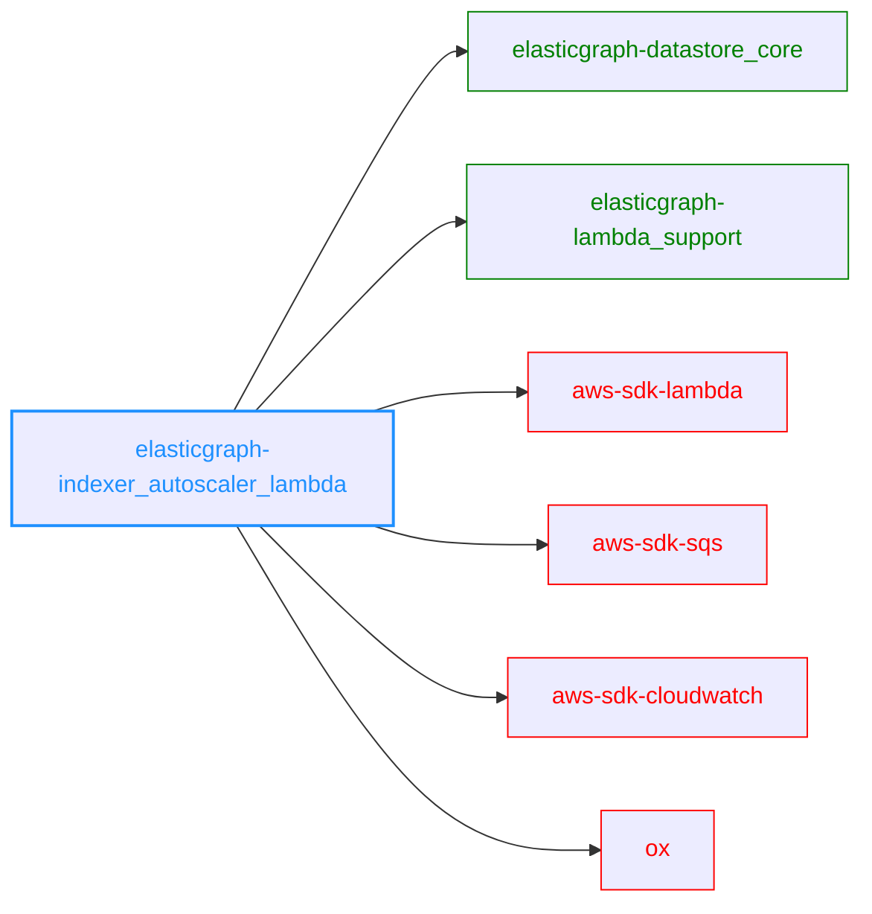

# ElasticGraph::IndexerAutoscalerLambda
## Dependency Diagram

```mermaid
graph LR;
    elasticgraph-indexer_autoscaler_lambda["elasticgraph-indexer_autoscaler_lambda"];
    elasticgraph-datastore_core["elasticgraph-datastore_core"];
    elasticgraph-indexer_autoscaler_lambda --> elasticgraph-datastore_core;
    elasticgraph-lambda_support["elasticgraph-lambda_support"];
    elasticgraph-indexer_autoscaler_lambda --> elasticgraph-lambda_support;
    aws-sdk-lambda["aws-sdk-lambda"];
    elasticgraph-indexer_autoscaler_lambda --> aws-sdk-lambda;
    aws-sdk-sqs["aws-sdk-sqs"];
    elasticgraph-indexer_autoscaler_lambda --> aws-sdk-sqs;
    aws-sdk-cloudwatch["aws-sdk-cloudwatch"];
    elasticgraph-indexer_autoscaler_lambda --> aws-sdk-cloudwatch;
    ox["ox"];
    elasticgraph-indexer_autoscaler_lambda --> ox;
    style elasticgraph-indexer_autoscaler_lambda color:DodgerBlue,stroke-width:2px,stroke:DodgerBlue;
    style elasticgraph-datastore_core color:Green,stroke:Green;
    style elasticgraph-lambda_support color:Green,stroke:Green;
    style aws-sdk-lambda color:Red,stroke:Red;
    style aws-sdk-sqs color:Red,stroke:Red;
    style aws-sdk-cloudwatch color:Red,stroke:Red;
    style ox color:Red,stroke:Red;
    click aws-sdk-lambda href "https://rubygems.org/gems/aws-sdk-lambda" "Open on RubyGems.org" _blank;
    click aws-sdk-sqs href "https://rubygems.org/gems/aws-sdk-sqs" "Open on RubyGems.org" _blank;
    click aws-sdk-cloudwatch href "https://rubygems.org/gems/aws-sdk-cloudwatch" "Open on RubyGems.org" _blank;
    click ox href "https://rubygems.org/gems/ox" "Open on RubyGems.org" _blank;
```
