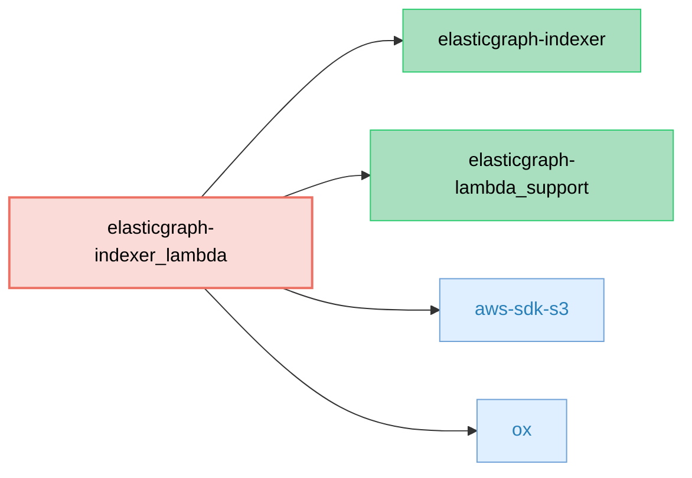

# ElasticGraph::IndexerLambda

Adapts elasticgraph-indexer to run in an AWS Lambda.

## Dependency Diagram

```mermaid
graph LR;
    classDef targetGemStyle fill:#FADBD8,stroke:#EC7063,color:#000,stroke-width:2px;
    classDef otherEgGemStyle fill:#A9DFBF,stroke:#2ECC71,color:#000;
    classDef externalGemStyle fill:#E0EFFF,stroke:#70A1D7,color:#2980B9;
    elasticgraph-indexer_lambda["elasticgraph-indexer_lambda"];
    class elasticgraph-indexer_lambda targetGemStyle;
    elasticgraph-indexer["elasticgraph-indexer"];
    elasticgraph-indexer_lambda --> elasticgraph-indexer;
    class elasticgraph-indexer otherEgGemStyle;
    elasticgraph-lambda_support["elasticgraph-lambda_support"];
    elasticgraph-indexer_lambda --> elasticgraph-lambda_support;
    class elasticgraph-lambda_support otherEgGemStyle;
    aws-sdk-s3["aws-sdk-s3"];
    elasticgraph-indexer_lambda --> aws-sdk-s3;
    class aws-sdk-s3 externalGemStyle;
    ox["ox"];
    elasticgraph-indexer_lambda --> ox;
    class ox externalGemStyle;
    click aws-sdk-s3 href "https://rubygems.org/gems/aws-sdk-s3" "Open on RubyGems.org" _blank;
    click ox href "https://rubygems.org/gems/ox" "Open on RubyGems.org" _blank;
```
