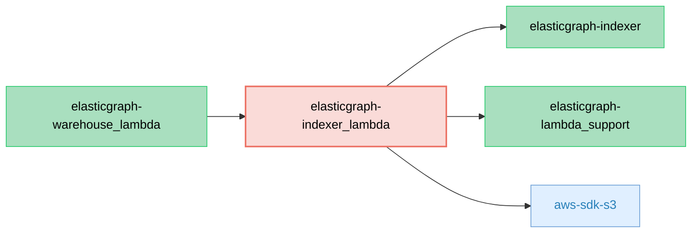

# ElasticGraph::IndexerLambda

Adapts elasticgraph-indexer to run in an AWS Lambda.

## Dependency Diagram


```mermaid
graph LR;
    classDef targetGemStyle fill:#FADBD8,stroke:#EC7063,color:#000,stroke-width:2px;
    classDef otherEgGemStyle fill:#A9DFBF,stroke:#2ECC71,color:#000;
    classDef externalGemStyle fill:#E0EFFF,stroke:#70A1D7,color:#2980B9;
    elasticgraph-indexer_lambda["elasticgraph-indexer_lambda"];
    class elasticgraph-indexer_lambda targetGemStyle;
    elasticgraph-indexer["elasticgraph-indexer"];
    elasticgraph-indexer_lambda --> elasticgraph-indexer;
    class elasticgraph-indexer otherEgGemStyle;
    elasticgraph-lambda_support["elasticgraph-lambda_support"];
    elasticgraph-indexer_lambda --> elasticgraph-lambda_support;
    class elasticgraph-lambda_support otherEgGemStyle;
    aws-sdk-s3["aws-sdk-s3"];
    elasticgraph-indexer_lambda --> aws-sdk-s3;
    class aws-sdk-s3 externalGemStyle;
    elasticgraph-warehouse_lambda["elasticgraph-warehouse_lambda"];
    elasticgraph-warehouse_lambda --> elasticgraph-indexer_lambda;
    class elasticgraph-warehouse_lambda otherEgGemStyle;
    click aws-sdk-s3 href "https://rubygems.org/gems/aws-sdk-s3" "Open on RubyGems.org" _blank;
```

## SQS Message Payload Format

This gem is designed to run in an AWS lambda that consumes from an SQS queue. Message payloads in the SQS queue are
decoded by the decoder configured via the `indexer.indexing_event_decoder` setting (see the `elasticgraph-indexer`
README for details). For example, with `ElasticGraph::JSONIngestion::IndexingEventDecoder` (provided by
`elasticgraph-json_ingestion`), messages use [JSON Lines](https://jsonlines.org/) format to encode indexing events.

A decoder can also implement `decode_with_metadata(payload, metadata:)` to receive SQS message attributes.
The `metadata` hash maps attribute names to their `stringValue` values, including number attributes encoded as strings.
It is empty when a message has no attributes. Attributes are passed alongside the fetched body for S3-offloaded messages.
Decoders that only implement `decode(payload)` continue to receive the payload as before.

JSON lines format contains individual JSON objects
delimited by a newline control character (not the `\n` string sequence), such as:

```
{"op": "upsert", "__typename": "Widget", "id": "123", "version": 1, "record": {...} }
{"op": "upsert", "__typename": "Widget", "id": "123", "version": 2, record: {...} }
```

When publishing into SQS, be sure to keep messages under the [256 KiB SQS message limit](https://docs.aws.amazon.com/AWSSimpleQueueService/latest/SQSDeveloperGuide/quotas-messages.html).
