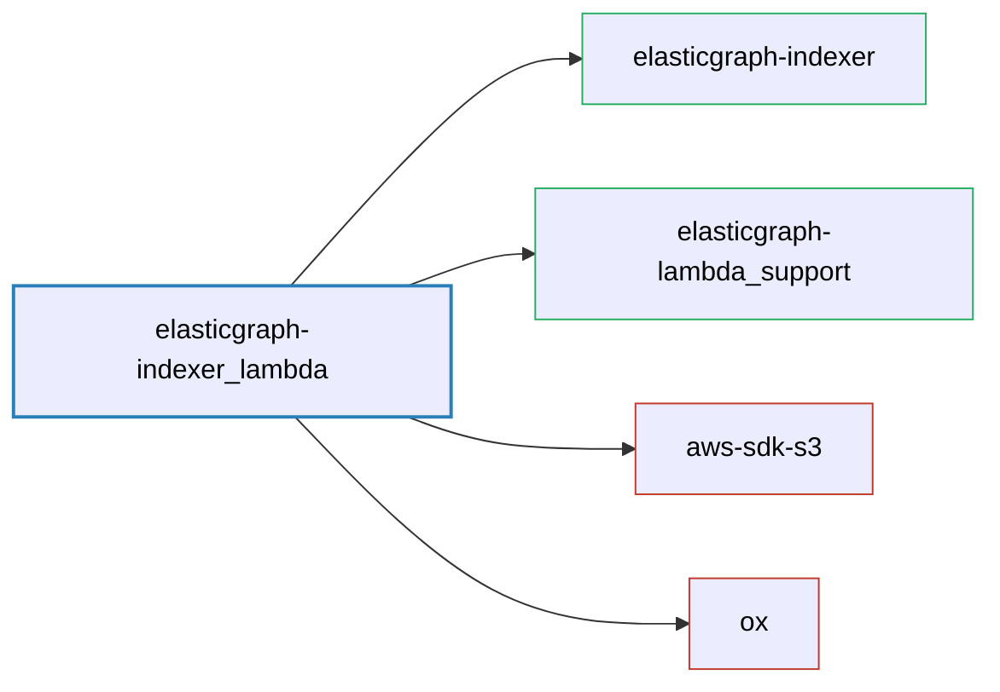

# ElasticGraph::IndexerLambda

Adapts elasticgraph-indexer to run in an AWS Lambda.

## Dependency Diagram



## SQS Message Payload Format

We use [JSON Lines](http://jsonlines.org/) to encode our indexing events. It is just individual JSON objects
delimited by a newline control character(not the `\n` string sequence), such as:

```jsonl
{"op": "upsert", "__typename": "Payment", "id": "123", "version": "1", "record": {...} }
{"op": "upsert", "__typename": "Payment", "id": "123", "version": "2", record: {...} }
{"op": "delete", "__typename": "Payment", "id": "123", "version": "3"}
```

However, due to SQS message size limit, we have to batch our events carefully so each batch is below the size limit.
This makes payload encoding a bit more complicated on the publisher side because each message has a size limit.
The following code snippet respects the max message size limit and sends JSON Lines payloads with proper size:

```ruby
def partition_into_acceptably_sized_chunks(batch, max_size_per_chunk)
  chunk_size = 0
  batch
    .map { |item| JSON.generate(item) }
    .slice_before do |json|
      chunk_size += (json.bytesize + 1)
      (chunk_size > max_size_per_chunk).tap { |chunk_done| chunk_size = 0 if chunk_done }
     end
    .map { |chunk| chunk.join("\n") }
end
```
