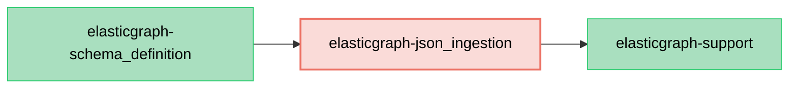

# ElasticGraph::JSONIngestion

JSON Schema ingestion support for ElasticGraph.

This gem contains the JSON Schema helper code used by schema definition to generate indexing
event schemas and merge ElasticGraph metadata into versioned schema artifacts.

## Dependency Diagram

