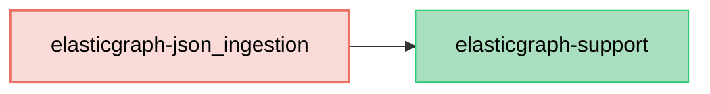

# ElasticGraph::JSONIngestion

Provides JSON Schema ingestion support for ElasticGraph.

This gem provides the schema-definition extension that generates JSON Schema artifacts for indexing
events and validates JSON-ingestion-specific schema options. Generated ElasticGraph projects install
and enable it by default. Applications that wire schema-definition tasks manually enable it by adding
`ElasticGraph::JSONIngestion::SchemaDefinition::APIExtension` to their schema-definition extension modules.

## Schema Definition APIs

Use `schema.json_schema_version` to identify the current JSON schema artifact. Every change that affects
the JSON schema should increment this version so publishers and indexers can safely evolve independently.
During early prototyping, `schema.enforce_json_schema_version false` can disable version-change enforcement.
For production applications, leave enforcement enabled so schema artifact changes require an intentional
version bump.

```diff
diff --git a/config/schema.rb b/config/schema.rb
index 015c5fa..b8eeaef 100644
--- a/config/schema.rb
+++ b/config/schema.rb
@@ -2,3 +2,3 @@ ElasticGraph.define_schema do |schema|
   # ElasticGraph will tell you when you need to bump this.
-  schema.json_schema_version 1
+  schema.json_schema_version 2

```

```ruby
# in config/schema/json_schema_enforcement.rb

ElasticGraph.define_schema do |schema|
  schema.enforce_json_schema_version false
end
```

Use `schema.json_schema_strictness` to configure whether indexing events may omit nullable fields or include
extra fields. We recommend enabling at most one of these options, because enabling both can hide misspelled
event fields.

```ruby
# in config/schema/json_schema_strictness.rb

ElasticGraph.define_schema do |schema|
  schema.json_schema_strictness allow_omitted_fields: true, allow_extra_fields: false
end
```

Custom scalar types must declare how they are represented in JSON Schema:

```ruby
# in config/schema/url.rb

ElasticGraph.define_schema do |schema|
  schema.scalar_type "URL" do |t|
    t.mapping type: "keyword"
    t.json_schema type: "string", format: "uri"
  end
end
```

Fields and object/interface types can add JSON Schema validations. Use field-level validations sparingly:
they run while indexing events, so violations can send otherwise valid source-system data to the dead letter
queue. They are best reserved for constraints that ElasticGraph needs in order to index correctly.

```ruby
# in config/schema/card.rb

ElasticGraph.define_schema do |schema|
  schema.object_type "Card" do |t|
    t.field "id", "ID!"

    t.field "expYear", "Int" do |f|
      f.json_schema minimum: 2000, maximum: 2099
    end

    t.field "expMonth", "Int" do |f|
      f.json_schema minimum: 1, maximum: 12
    end

    t.index "cards"
  end
end
```

On fields, `nullable: false` disallows `null` in indexing events while keeping the GraphQL field nullable:

```ruby
# in config/schema/widget.rb

ElasticGraph.define_schema do |schema|
  schema.object_type "Widget" do |t|
    t.field "id", "ID!"

    t.field "name", "String" do |f|
      f.json_schema nullable: false
    end

    t.index "widgets"
  end
end
```

## Dependency Diagram


