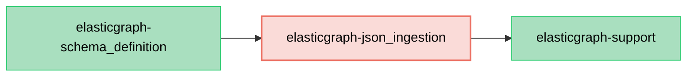

# ElasticGraph::JSONIngestion

Pluggable JSON Schema ingestion serializer for ElasticGraph.

This gem extracts the JSON Schema generation and validation logic from ElasticGraph's core into a
pluggable extension, following the same pattern as `elasticgraph-warehouse` and `elasticgraph-apollo`.
This is the first step toward supporting alternative ingestion serializers (e.g., Protocol Buffers).

Higher-level schema-definition entry points use the JSON Schema serializer by default for backward
compatibility, so existing users do not need configuration changes.

## Dependency Diagram

