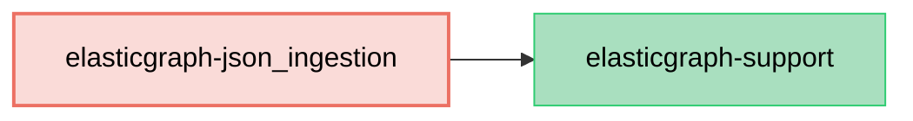

# ElasticGraph::JSONIngestion

Provides JSON Schema ingestion support for ElasticGraph.

This gem provides the schema-definition extension that generates JSON Schema artifacts for indexing
events and validates JSON-ingestion-specific schema options. Generated ElasticGraph projects install
and enable it by default. Applications that wire schema-definition tasks manually enable it by adding
`ElasticGraph::JSONIngestion::SchemaDefinition::APIExtension` to their schema-definition extension modules.

## Schema Definition APIs

Use `schema.json_schema_version` to identify the current JSON schema artifact. Every change that affects
the JSON schema should increment this version so publishers and indexers can safely evolve independently.
During early prototyping, `schema.enforce_json_schema_version false` can disable version-change enforcement.
For production applications, leave enforcement enabled so schema artifact changes require an intentional
version bump.

```diff
diff --git a/config/schema.rb b/config/schema.rb
index 015c5fa..b8eeaef 100644
--- a/config/schema.rb
+++ b/config/schema.rb
@@ -2,3 +2,3 @@ ElasticGraph.define_schema do |schema|
   # ElasticGraph will tell you when you need to bump this.
-  schema.json_schema_version 1
+  schema.json_schema_version 2

```

```ruby
# in config/schema/json_schema_enforcement.rb

ElasticGraph.define_schema do |schema|
  schema.enforce_json_schema_version false
end
```

Use `schema.json_schema_strictness` to configure whether indexing events may omit nullable fields or include
extra fields. We recommend enabling at most one of these options, because enabling both can hide misspelled
event fields.

```ruby
# in config/schema/json_schema_strictness.rb

ElasticGraph.define_schema do |schema|
  schema.json_schema_strictness allow_omitted_fields: true, allow_extra_fields: false
end
```

Custom scalar types must declare how they are represented in JSON Schema:

```ruby
# in config/schema/url.rb

ElasticGraph.define_schema do |schema|
  schema.scalar_type "URL" do |t|
    t.mapping type: "keyword"
    t.json_schema type: "string", format: "uri"
  end
end
```

Fields and object/interface types can add JSON Schema validations. Use field-level validations sparingly:
they run while indexing events, so violations can send otherwise valid source-system data to the dead letter
queue. They are best reserved for constraints that ElasticGraph needs in order to index correctly.

```ruby
# in config/schema/card.rb

ElasticGraph.define_schema do |schema|
  schema.object_type "Card" do |t|
    t.field "id", "ID!"

    t.field "expYear", "Int" do |f|
      f.json_schema minimum: 2000, maximum: 2099
    end

    t.field "expMonth", "Int" do |f|
      f.json_schema minimum: 1, maximum: 12
    end

    t.index "cards"
  end
end
```

On fields, `nullable: false` disallows `null` in indexing events while keeping the GraphQL field nullable:

```ruby
# in config/schema/widget.rb

ElasticGraph.define_schema do |schema|
  schema.object_type "Widget" do |t|
    t.field "id", "ID!"

    t.field "name", "String" do |f|
      f.json_schema nullable: false
    end

    t.index "widgets"
  end
end
```

## Indexing Support

Beyond schema definition, this gem teaches `elasticgraph-indexer` how to ingest JSON events: it provides an
ingestion adapter that validates each event against the JSON schema identified by the event's
`schema_version` and prepares its record for indexing using that version's view of the schema.

Defining your schema with this gem's `SchemaDefinition::APIExtension` registers an indexer extension in
your generated runtime metadata. Install this gem in the indexer deployment and regenerate the artifacts
to make the adapter available. Encoded transports also need the decoder configuration below.

### Schema versions

The adapter resolves the version of each event as follows:

- The `schema_version` key selects the JSON schema version. When the exact version is unavailable, the
  adapter selects the closest available version and logs `ElasticGraphMissingJSONSchemaVersion`.
- The legacy `json_schema_version` key still works, so a publisher or an in-process caller that predates
  the ingestion-format-neutral key needs no change. If both keys are present, `schema_version` wins
  for both direct events and decoded payloads. A non-integer value such as `false` is rejected; a missing
  or null version selects the latest schema.
- An event that carries neither key gets the latest available JSON schema version. The adapter still
  validates the event against that version, so a malformed event still fails.

After validation, the adapter returns a normalized copy of the event with `schema_version` set to the
version it selected and the legacy alias removed. Logs and warehouse partitions use that selected
version, including when an event omitted its version or requested an unavailable one. The original
event is not mutated; fallback logs retain both the requested and selected versions.

Publishers should continue sending an explicit JSON schema version and deployments should retain the
historical artifacts needed to process queued events. Omitting a version ties interpretation to the
latest schema installed on each indexer. Replaying the same unversioned event after a rename, deletion,
or validation change can produce a different result or fail validation. Optional versions are useful
for prototyping; they do not provide the same schema-evolution guarantees as versioned events.

This gem also provides the `be_a_valid_elastic_graph_event` RSpec matcher (via
`require "elastic_graph/json_ingestion/spec_support/event_matcher"`) for testing that publisher events
conform to your schema.

## Indexing Event Decoding

This gem also provides `ElasticGraph::JSONIngestion::IndexingEventDecoder`, which decodes JSON Lines payloads
into ElasticGraph indexing event hashes. Configure it as your indexer's indexing event decoder (generated
ElasticGraph projects include this configuration):

```yaml
indexer:
  indexing_event_decoder:
    name: ElasticGraph::JSONIngestion::IndexingEventDecoder
    require_path: elastic_graph/json_ingestion/indexing_event_decoder
```

The decoder tags events with `ingestion_format: "json"` and leaves version resolution to the adapter.
This also routes versionless JSON correctly when several adapters are installed. Untagged direct events
continue to default to JSON; decoders and direct callers for other formats must set their format tag.
An explicitly different format is never routed to JSON just because it is the only installed adapter.

See the `elasticgraph-indexer` README for the decoder extension interface.

## Upgrading an existing JSON deployment

1. Include `elasticgraph-json_ingestion` in the indexer's runtime bundle, including both indexing and
   warehouse Lambda packages. A dependency restricted to development or schema generation is insufficient.
2. Enable `ElasticGraph::JSONIngestion::SchemaDefinition::APIExtension` in your schema definition if it
   is not already enabled. Run `bundle exec rake schema_artifacts:dump` and deploy the regenerated
   runtime metadata together with the matching gems. Older runtime metadata does not register the adapter.
3. Add the `indexer.indexing_event_decoder` configuration shown above to each environment that consumes
   encoded payloads, including both SQS Lambdas. Direct calls to `indexer.processor.process` do not need a decoder.
4. Change matcher requires from `elastic_graph/indexer/spec_support/event_matcher` to
   `elastic_graph/json_ingestion/spec_support/event_matcher`. Custom code that used
   `indexer.record_preparer_factory` can construct `ElasticGraph::JSONIngestion::RecordPreparerFactory`
   with `indexer.schema_artifacts` instead.
5. Keep publishing `json_schema_version`; existing publisher envelopes and versioned JSON schema
   artifacts remain supported. Latency and warehouse logs include the deprecated `json_schema_version`
   alias alongside `schema_version`. Both now report the selected version. Warehouse JSON events that
   omit a version use the selected version's partition; `unversioned` is reserved for genuinely
   unversioned ingestion formats.

Generated project templates include the decoder setting, but existing project settings are not
rewritten automatically. Validate an existing publisher event through your deployed transport after
upgrading, and check its schema version in the indexing or warehouse logs.

## Dependency Diagram


```mermaid
graph LR;
    classDef targetGemStyle fill:#FADBD8,stroke:#EC7063,color:#000,stroke-width:2px;
    classDef otherEgGemStyle fill:#A9DFBF,stroke:#2ECC71,color:#000;
    classDef externalGemStyle fill:#E0EFFF,stroke:#70A1D7,color:#2980B9;
    elasticgraph-json_ingestion["elasticgraph-json_ingestion"];
    class elasticgraph-json_ingestion targetGemStyle;
    elasticgraph-support["elasticgraph-support"];
    elasticgraph-json_ingestion --> elasticgraph-support;
    class elasticgraph-support otherEgGemStyle;
```
