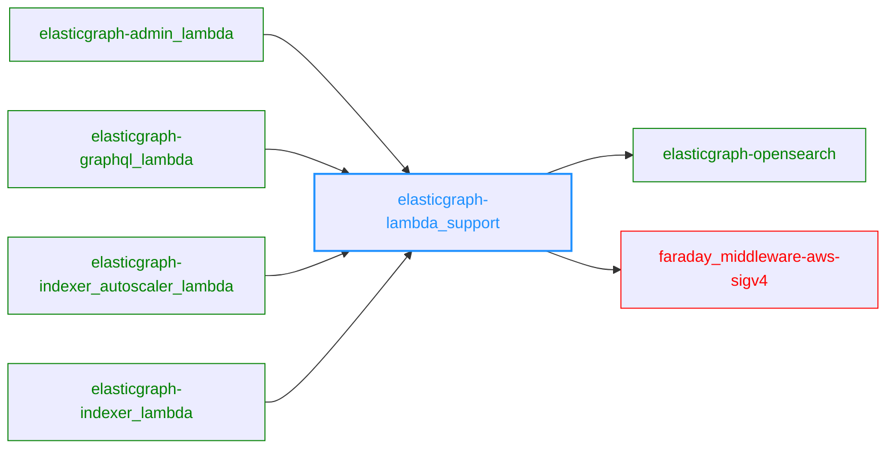

# ElasticGraph::LambdaSupport

This gem contains common lambda support logic that is used by all ElasticGraph
lambdas, such as lambda logging and OpenSearch connection support.

It is not meant to be used directly by end users of ElasticGraph.

## Dependency Diagram

