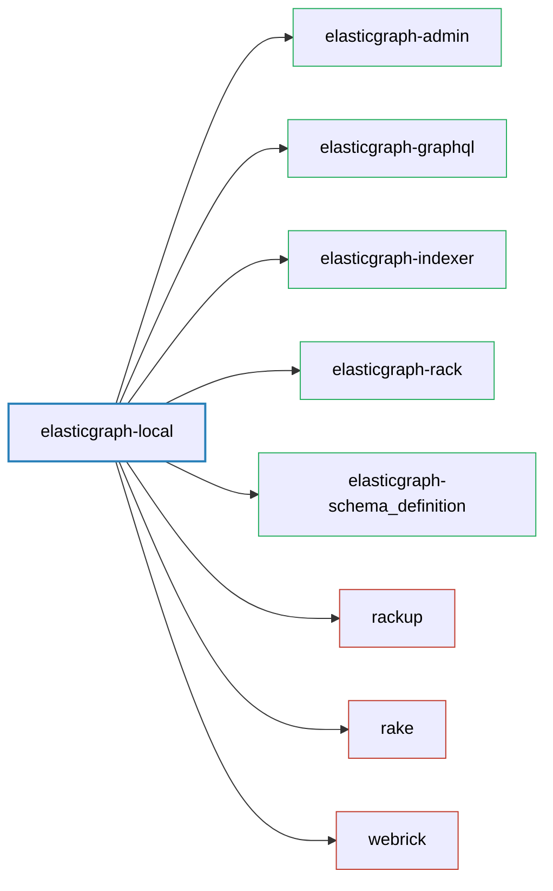

# ElasticGraph::Local

Provides support for developing and running ElasticGraph applications locally.
These locally running ElasticGraph applications use 100% fake generated data
so as not to require a publisher of real data to be implemented.

## Dependency Diagram



## Installation

Add `elasticgraph-local` to a new project `Gemfile`:

```ruby
source "https://rubygems.org"

group :development do
  gem "factory_bot"
  gem "faker"
  gem "elasticgraph-local"
end
```

As shown above, you can also pull in any gems that will help you
generate fake data. We tend to use [factory_bot](https://github.com/thoughtbot/factory_bot)
and [faker](https://github.com/faker-ruby/faker). `elasticgraph-local` should be defined
in the `development` group (you don't want to include it in any staging or production
deployment).

Next, install the `elasticgraph-local` rake tasks in your `Rakefile`, with code like:

``` ruby
require 'elastic_graph/local/rake_tasks'

ElasticGraph::Local::RakeTasks.new(
  local_config_yaml: "config/settings/development.yaml",
  path_to_schema: "config/schema.rb"
) do |tasks|
  tasks.define_fake_data_batch_for :widgets do |batch|
    # Use faker/factory_bot etc here to generate fake data
    # and add it to the `batch` array.
    # You'll probably want to put that logic in another file
    # and load it from here.
  end
end
```

## Usage

Everything you need is provided by rake tasks. Run the following to see what they are:

```bash
$ bundle exec rake -T
```

At a high level, this provides tasks that help you to:

1. Boot Elasticsearch/OpenSearch (+ their corresponding dashboards) locally using the `opensearch:*`/`elasticsearch:*` tasks.
2. Generate and validate ElasticGraph schema artifacts using the `schema_artifacts:*` tasks.
3. Configure your locally running Elasticsearch/OpenSearch using the `clusters:configure:perform` task.
4. Index fake data into Elasticsearch/OpenSearch (either running locally or on AWS) using the `index_fake_data:*` tasks.
5. Boot the ElasticGraph GraphQL endpoint and GraphiQL in-browser UI using the `boot_graphiql` task.

If you just want to boot ElasticGraph locally without worrying about any of the details, run:

```
$ bundle exec rake boot_locally
```

That sequences each of the other tasks so that, with a single command, you can go from nothing to a
locally running ElasticGraph instance with data that you can query from your browser.

### Managing Elasticsearch/Opensearch

The `opensearch:`/`elasticsearch:` tasks will boot the desired Elasticsearch or OpenSearch version using docker
along with the corresponding dashboards (Kibana for Elasticsearch, OpenSearch Dashboards for OpenSearch). You can
use either the `:boot` or `:daemon` tasks:

* The `:boot` task will keep Elasticsearch/Opensearch in the foreground, allowing you to see the logs.
* The `:daemon` task runs Elasticsearch/Opensearch as a background daemon task. Notably, it waits to return
  until Elasticsearch/Opensearch are ready to receive traffic.

If you use a `:daemon` task, you can later use the corresponding `:halt` task to stop the daemon.
