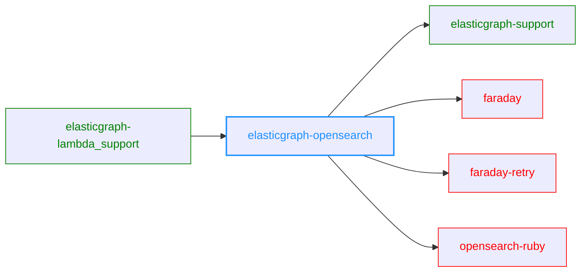

# ElasticGraph::OpenSearch

Wraps the official OpenSearch client for use by ElasticGraph.

## Dependency Diagram

```mermaid
graph LR;
    elasticgraph-opensearch["elasticgraph-opensearch"];
    elasticgraph-support["elasticgraph-support"];
    elasticgraph-opensearch --> elasticgraph-support;
    faraday["faraday"];
    elasticgraph-opensearch --> faraday;
    faraday-retry["faraday-retry"];
    elasticgraph-opensearch --> faraday-retry;
    opensearch-ruby["opensearch-ruby"];
    elasticgraph-opensearch --> opensearch-ruby;
    elasticgraph-lambda_support["elasticgraph-lambda_support"];
    elasticgraph-lambda_support --> elasticgraph-opensearch;
    style elasticgraph-opensearch color:DodgerBlue,stroke-width:2px,stroke:DodgerBlue;
    style elasticgraph-support color:Green,stroke:Green;
    style faraday color:Red,stroke:Red;
    style faraday-retry color:Red,stroke:Red;
    style opensearch-ruby color:Red,stroke:Red;
    style elasticgraph-lambda_support color:Green,stroke:Green;
    click faraday href "https://rubygems.org/gems/faraday" "Open on RubyGems.org" _blank;
    click faraday-retry href "https://rubygems.org/gems/faraday-retry" "Open on RubyGems.org" _blank;
    click opensearch-ruby href "https://rubygems.org/gems/opensearch-ruby" "Open on RubyGems.org" _blank;
```
