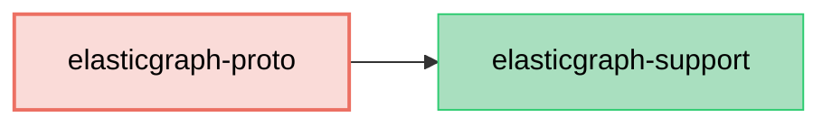

# ElasticGraph::Proto

An ElasticGraph extension that generates Protocol Buffers (`proto3`) schema artifacts from ElasticGraph schemas.

## Dependency Diagram



## Usage

First, add `elasticgraph-proto` to your `Gemfile`, alongside the other ElasticGraph gems:

```diff
diff --git a/Gemfile b/Gemfile
index 4a5ef1e..5c16c2b 100644
--- a/Gemfile
+++ b/Gemfile
@@ -8,6 +8,7 @@ gem "elasticgraph-query_registry", *elasticgraph_details

 # Can be elasticgraph-elasticsearch or elasticgraph-opensearch based on the datastore you want to use.
 gem "elasticgraph-opensearch", *elasticgraph_details
+gem "elasticgraph-proto", *elasticgraph_details

 gem "httpx", "~> 1.3"

```

Next, update your `Rakefile` so that `ElasticGraph::Proto::SchemaDefinition::APIExtension` is
used as one of the `schema_definition_extension_modules`:

```diff
diff --git a/Rakefile b/Rakefile
index 2943335..26633c3 100644
--- a/Rakefile
+++ b/Rakefile
@@ -1,5 +1,6 @@
 project_root = File.expand_path(__dir__)

+require "elastic_graph/proto/schema_definition/api_extension"
 require "elastic_graph/local/rake_tasks"
 require "elastic_graph/query_registry/rake_tasks"
 require "rspec/core/rake_task"
@@ -12,6 +13,8 @@ ElasticGraph::Local::RakeTasks.new(
   local_config_yaml: settings_file,
   path_to_schema: "#{project_root}/config/schema.rb"
 ) do |tasks|
+  tasks.schema_definition_extension_modules = [ElasticGraph::Proto::SchemaDefinition::APIExtension]
+
   # Set this to true once you're beyond the prototyping stage.
   tasks.enforce_json_schema_version = false

```

After running `bundle exec rake schema_artifacts:dump`, a `schema.proto` file will be generated
for indexed types.

## Schema Definition Options

### Custom Scalar Types

Built-in ElasticGraph scalar types are automatically mapped to proto scalar types.
For custom scalar types, the generator infers proto scalar types from `json_schema type:` when it is one
of `string`, `boolean`, `number`, or `integer`. You can override inference with `proto_field`:

```ruby
# in config/schema/money.rb

ElasticGraph.define_schema do |schema|
  schema.scalar_type "Money" do |t|
    t.mapping type: "long"
    t.json_schema type: "integer"
    t.proto_field type: "int64"
  end
end
```

### Replacing JSON Schema Artifacts

By default, this extension adds `schema.proto` while keeping JSON schema artifacts.
To replace JSON schema artifacts during `schema_artifacts:dump`, configure:

```ruby
# in config/schema/widget.rb

ElasticGraph.define_schema do |schema|
  schema.proto_schema_artifacts replace_json_schemas: true
end
```

### Sourcing Enum Values From Existing Proto Mappings

If your project already maintains GraphQL-to-proto enum mappings (for example in tests),
you can reuse them for proto schema generation:

```ruby
ElasticGraph.define_schema do |schema|
  schema.proto_enum_mappings SalesEg::ProtoEnumMappings::PROTO_ENUMS_BY_GRAPHQL_ENUM
end
```

When a mapping exists for an enum, `elasticgraph-proto` uses the mapped proto enum(s)
as the source of enum values (respecting `exclusions`, `expected_extras`, and `name_transform`).

### Freezing Field Numbers

To ensure protobuf field numbers never drift, configure a mapping artifact file:

```ruby
ElasticGraph.define_schema do |schema|
  schema.proto_schema_artifacts(
    field_number_mapping_file: "proto_field_numbers.yaml",
    enforce_field_number_mapping: true
  )
end
```

With this configured:
- `schema_artifacts:dump` reads `proto_field_numbers.yaml` and uses it for field numbering.
- Existing numbers stay fixed even if field order changes.
- New fields get the next available numbers and the mapping file is updated.
- In enforce mode, generation fails if the mapping file is missing.

## Type Mappings

The generated `schema.proto` uses these built-in scalar mappings:

| ElasticGraph Type | Proto Type |
|-------------------|------------|
| `Boolean`         | `bool`     |
| `Cursor`          | `string`   |
| `Date`            | `string`   |
| `DateTime`        | `string`   |
| `Float`           | `double`   |
| `ID`              | `string`   |
| `Int`             | `int32`    |
| `JsonSafeLong`    | `int64`    |
| `LocalTime`       | `string`   |
| `LongString`      | `int64`    |
| `String`          | `string`   |
| `TimeZone`        | `string`   |
| `Untyped`         | `string`   |

Additionally:
- List types become `repeated` fields.
- Nested list types generate wrapper messages so the output remains valid `proto3`.
- Enum types generate `enum` definitions with a zero-valued `*_UNSPECIFIED` entry.
