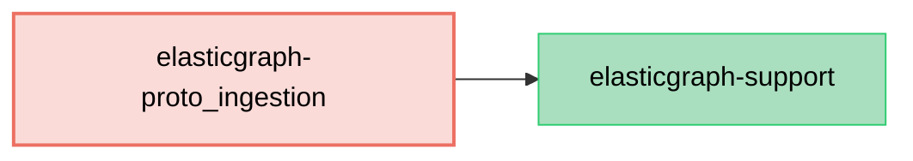

# ElasticGraph::ProtoIngestion

An ElasticGraph extension that supports ingesting Protocol Buffer data into ElasticGraph.

## Dependency Diagram

```mermaid
graph LR;
    classDef targetGemStyle fill:#FADBD8,stroke:#EC7063,color:#000,stroke-width:2px;
    classDef otherEgGemStyle fill:#A9DFBF,stroke:#2ECC71,color:#000;
    classDef externalGemStyle fill:#E0EFFF,stroke:#70A1D7,color:#2980B9;
    elasticgraph-proto_ingestion["elasticgraph-proto_ingestion"];
    class elasticgraph-proto_ingestion targetGemStyle;
    elasticgraph-support["elasticgraph-support"];
    elasticgraph-proto_ingestion --> elasticgraph-support;
    class elasticgraph-support otherEgGemStyle;
```
