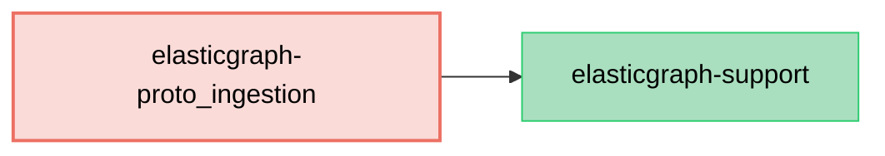

# ElasticGraph::ProtoIngestion

An ElasticGraph extension that supports ingesting Protocol Buffer data into ElasticGraph.
Currently it generates `proto3` Protocol Buffers schema artifacts from ElasticGraph schemas.

## Dependency Diagram



## Usage

First, add `elasticgraph-proto_ingestion` to your `Gemfile`, alongside the other ElasticGraph gems:

```diff
diff --git a/Gemfile b/Gemfile
index 4a5ef1e..5c16c2b 100644
--- a/Gemfile
+++ b/Gemfile
@@ -8,6 +8,7 @@ gem "elasticgraph-query_registry", *elasticgraph_details

 # Can be elasticgraph-elasticsearch or elasticgraph-opensearch based on the datastore you want to use.
 gem "elasticgraph-opensearch", *elasticgraph_details
+gem "elasticgraph-proto_ingestion", *elasticgraph_details

 gem "httpx", "~> 1.3"

```

Next, update your `Rakefile` so that `ElasticGraph::ProtoIngestion::SchemaDefinition::APIExtension` is
included in the schema-definition extension modules:

```diff
diff --git a/Rakefile b/Rakefile
index 2943335..26633c3 100644
--- a/Rakefile
+++ b/Rakefile
@@ -3,5 +3,6 @@
 require "elastic_graph/json_ingestion/schema_definition/api_extension"
 require "elastic_graph/local/rake_tasks"
+require "elastic_graph/proto_ingestion/schema_definition/api_extension"
 require "elastic_graph/query_registry/rake_tasks"
 require "rspec/core/rake_task"
 require "standard/rake"
@@ -16,6 +17,7 @@ ElasticGraph::Local::RakeTasks.new(
   # Determines casing of field names. Can be either `:camelCase` or `:snake_case`.
   tasks.schema_element_name_form = :camelCase
   tasks.schema_definition_extension_modules << ElasticGraph::JSONIngestion::SchemaDefinition::APIExtension
+  tasks.schema_definition_extension_modules << ElasticGraph::ProtoIngestion::SchemaDefinition::APIExtension

   # Customizes the names of fields generated by ElasticGraph.
   tasks.schema_element_name_overrides = {
```

Adding the schema definition extension automatically enables `schema.proto` generation with the default
`elasticgraph` package. Optionally, configure a custom package name from your schema definition:

```ruby
# in config/schema/protobuf.rb

ElasticGraph.define_schema do |schema|
  schema.proto_schema_artifacts package_name: "myapp.events.v1"
end
```

After running `bundle exec rake schema_artifacts:dump`, ElasticGraph will generate:

- `schema.proto`
- `proto_field_numbers.yaml`

## Schema Definition API

### Custom Scalar Types

Built-in ElasticGraph scalar types are automatically mapped to proto scalar types.
For custom scalar types, use `protobuf` to define the proto scalar type:

```ruby
# in config/schema/email.rb

ElasticGraph.define_schema do |schema|
  schema.scalar_type "Email" do |t|
    t.mapping type: "keyword"
    t.json_schema type: "string", format: "email"
    t.protobuf type: "string"
  end
end
```

### Stable Field Numbers

`schema_artifacts:dump` automatically reads and writes `proto_field_numbers.yaml`
in the schema artifacts directory. Existing numbers stay fixed even if field order
changes, and new fields get the next available numbers. Field numbers follow protobuf's
rules: they must be between 1 and 536,870,911, and the protobuf-reserved 19000-19999
range is never allocated and is rejected in mappings.

Alternatives inside generated interface and union `oneof` blocks use the same stable
message-field mappings, so adding or removing a concrete subtype does not renumber the
remaining alternatives.

`schema.proto` always uses the public GraphQL field names. When a field uses a
different `name_in_index`, the sidecar YAML stores that override privately:

```yaml
messages:
  Widget:
    fields:
      id: 1
      display_name:
        field_number: 2
        name_in_index: displayName
```

If a field is renamed with `field.renamed_from`, `elasticgraph-proto_ingestion` reuses the
existing field number under the new public field name.

### Stable Enum Value Numbers

Enum value numbers are pinned the same way, in an `enums` section of the sidecar. Existing
values keep their numbers when other values are added or removed, new values get the next
available numbers, and removed values keep their numbers reserved so they are never reused
(number `0` is always the generated `*_UNSPECIFIED` value):

```yaml
enums:
  WidgetColor:
    values:
      RED: 1
      BLUE: 2
```

## Type Mappings

The generated `schema.proto` uses these built-in scalar mappings:

| ElasticGraph Type | Protobuf Type |
|-------------------|------------|
| `Boolean`         | `bool`     |
| `Cursor`          | `string`   |
| `Date`            | `string`   |
| `DateTime`        | `string`   |
| `Float`           | `double`   |
| `ID`              | `string`   |
| `Int`             | `int32`    |
| `JsonSafeLong`    | `int64`    |
| `LocalTime`       | `string`   |
| `LongString`      | `int64`    |
| `String`          | `string`   |
| `TimeZone`        | `string`   |
| `Untyped`         | `string`   |

Additionally:
- List types become `repeated` fields.
- Lists of lists (e.g. `[[Float!]!]!`) are not supported because Protocol Buffers cannot represent
  them directly. Schema artifact generation raises an error identifying the unsupported field.
- Enum types generate `enum` definitions whose values are prefixed with the enum type name in `UPPER_SNAKE_CASE`, including a zero-valued `*_UNSPECIFIED` entry.
