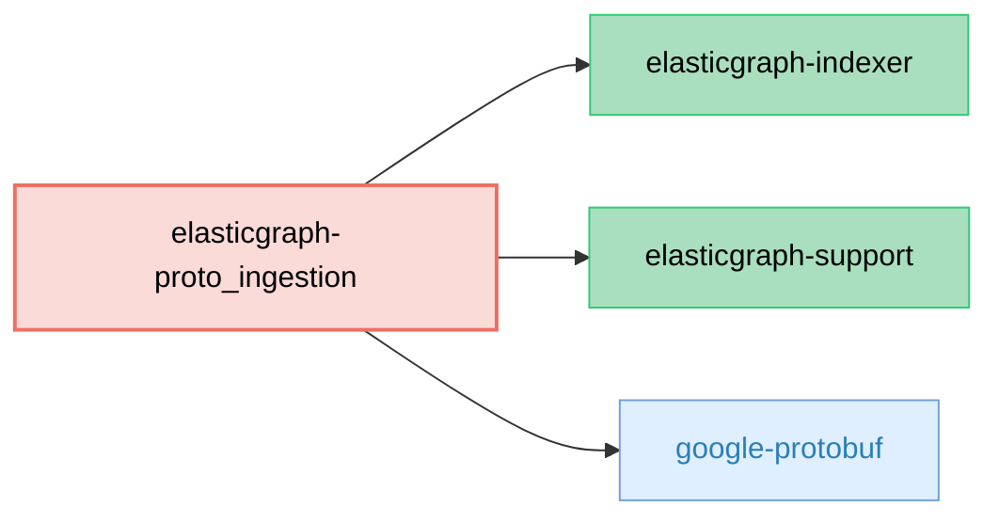

# ElasticGraph::ProtoIngestion

An ElasticGraph extension that supports ingesting Protocol Buffer data into ElasticGraph.
It generates protobuf schemas and ingests binary events through the shared indexing pipeline.
It supports `proto3` (default) and `proto2`, both independently of JSON ingestion and alongside it.

## Dependency Diagram


```mermaid
graph LR;
    classDef targetGemStyle fill:#FADBD8,stroke:#EC7063,color:#000,stroke-width:2px;
    classDef otherEgGemStyle fill:#A9DFBF,stroke:#2ECC71,color:#000;
    classDef externalGemStyle fill:#E0EFFF,stroke:#70A1D7,color:#2980B9;
    elasticgraph-proto_ingestion["elasticgraph-proto_ingestion"];
    class elasticgraph-proto_ingestion targetGemStyle;
    elasticgraph-indexer["elasticgraph-indexer"];
    elasticgraph-proto_ingestion --> elasticgraph-indexer;
    class elasticgraph-indexer otherEgGemStyle;
    elasticgraph-support["elasticgraph-support"];
    elasticgraph-proto_ingestion --> elasticgraph-support;
    class elasticgraph-support otherEgGemStyle;
    google-protobuf["google-protobuf"];
    elasticgraph-proto_ingestion --> google-protobuf;
    class google-protobuf externalGemStyle;
    click google-protobuf href "https://rubygems.org/gems/google-protobuf" "Open on RubyGems.org" _blank;
```

## Usage

First, add `elasticgraph-proto_ingestion` to your `Gemfile`, alongside the other ElasticGraph gems:

```diff
diff --git a/Gemfile b/Gemfile
index 4a5ef1e..5c16c2b 100644
--- a/Gemfile
+++ b/Gemfile
@@ -8,6 +8,7 @@ gem "elasticgraph-query_registry", *elasticgraph_details

 # Can be elasticgraph-elasticsearch or elasticgraph-opensearch based on the datastore you want to use.
 gem "elasticgraph-opensearch", *elasticgraph_details
+gem "elasticgraph-proto_ingestion", *elasticgraph_details

 gem "httpx", "~> 1.3"

```

Next, update your `Rakefile` so that `ElasticGraph::ProtoIngestion::SchemaDefinition::APIExtension` is
included in the schema-definition extension modules:

```diff
diff --git a/Rakefile b/Rakefile
index 2943335..26633c3 100644
--- a/Rakefile
+++ b/Rakefile
@@ -3,5 +3,6 @@
 require "elastic_graph/json_ingestion/schema_definition/api_extension"
 require "elastic_graph/local/rake_tasks"
+require "elastic_graph/proto_ingestion/schema_definition/api_extension"
 require "elastic_graph/query_registry/rake_tasks"
 require "rspec/core/rake_task"
 require "standard/rake"
@@ -16,6 +17,7 @@ ElasticGraph::Local::RakeTasks.new(
   # Determines casing of field names. Can be either `:camelCase` or `:snake_case`.
   tasks.schema_element_name_form = :camelCase
   tasks.schema_definition_extension_modules << ElasticGraph::JSONIngestion::SchemaDefinition::APIExtension
+  tasks.schema_definition_extension_modules << ElasticGraph::ProtoIngestion::SchemaDefinition::APIExtension

   # Customizes the names of fields generated by ElasticGraph.
   tasks.schema_element_name_overrides = {
```

Adding the schema definition extension automatically enables `schema.proto` generation with the default
`elasticgraph` package. Optionally, configure a custom package name from your schema definition:

```ruby
# in config/schema/protobuf.rb

ElasticGraph.define_schema do |schema|
  schema.proto_schema_artifacts package_name: "myapp.events.v1"
end
```

After running `bundle exec rake schema_artifacts:dump`, ElasticGraph will generate a `schema.proto`
schema artifact, and will maintain a `proto_field_numbers.yaml` file alongside your schema definition.

## Runtime Ingestion

The schema definition extension registers the protobuf ingestion adapter automatically. It also
generates `indexing_events.proto`, with an `ElasticGraphEventEnvelope` containing event metadata
and a `oneof record` of concrete ingestible types, and an `ElasticGraphEventBatch` containing
repeated envelopes. Domain messages remain in `schema.proto` and can be consumed independently.
Envelope alternatives use names such as `record_widget`; their numbers are maintained in
`proto_field_numbers.yaml`, including reservations when types are removed.

Private field metadata lives in `runtime_metadata.yaml`. The protobuf adapter uses it to translate
public names to index names, apply scalar indexing preparers, and reconstruct interface and union
`__typename` values. No JSON schema artifacts or JSON schema version are required. Projects using
only protobuf can omit the JSON ingestion schema definition extension and its `json_schema_version`
and `json_schema` DSL calls.

After dumping artifacts, compile both generated files into a descriptor set with imports. Use a
standard `protoc` version supporting proto3 optional fields (3.15 or newer):

```bash
bundle exec rake schema_artifacts:dump
protoc --proto_path=config/schema/artifacts --include_imports \
  --descriptor_set_out=config/schema/artifacts/schema.pb \
  schema.proto indexing_events.proto
```

Add further `--proto_path` arguments for any imported custom scalar definitions. Package the
resulting `schema.pb` with the matching schema artifacts in the indexer deployment. The runtime
uses the `google-protobuf` gem and an isolated descriptor pool; it does not run `protoc` or load
generated Ruby constants into a shared global pool.

Configure the decoder in your application settings:

```yaml
indexer:
  indexing_event_decoder:
    name: ElasticGraph::ProtoIngestion::IndexingEventDecoder
    require_path: elastic_graph/proto_ingestion/indexing_event_decoder
    config:
      descriptor_set_file: config/schema/artifacts/schema.pb
      format: envelope
      encoding: base64
```

### Batched envelopes

With `format: envelope`, the payload is one serialized `ElasticGraphEventBatch`. Each envelope has
`op` (`upsert`), `id`, a positive `int64 version` for ordering updates, optional
`latency_timestamps` (a string-to-ISO-8601-string map), and one `record_<type>` alternative.
The envelope's `id` takes precedence over an ID in the record. This format keeps per-event metadata
with each record when batching or archiving payloads.

Use `encoding: base64` for SQS message bodies, which carry text. Use `encoding: binary` (the default)
for binary transports or direct calls to `indexer.indexing_event_decoder.decode(payload)`.
Send the decoded events to `indexer.processor.process(events)`. The SQS Lambda integration invokes
the decoder and processor automatically, including for S3-offloaded payloads.

### Raw domain messages

With `format: raw`, the payload contains one serialized domain message. Call the decoder's
`decode_with_metadata(payload, metadata: properties)` method with these UTF-8 string properties,
then pass the resulting events to the processor:

| Property | Meaning |
|----------|---------|
| `eg_op` | `upsert` |
| `eg_type` | Concrete ElasticGraph type name, without the protobuf package |
| `eg_id` | Record identifier |
| `eg_version` | Positive decimal integer for update ordering |

Kafka consumers can supply record headers; Pulsar consumers can supply message properties. The
SQS integration supplies `messageAttributes` automatically for metadata-aware decoders. An optional
`metadata_fields` configuration maps canonical names (`op`, `type`, `id`, `version`) to alternate
transport property names. The format is explicitly configured; the decoder does not guess from bytes.

### Validation and wire semantics

Protobuf decoding enforces wire types. The adapter checks the event envelope and ElasticGraph's
additional constraints, including non-null fields, known enum values, scalar ranges, dates, times,
and time zones. It uses no JSON Schema validation. `skip_record_validation_percents_by_type` controls
semantic record validation, while envelope validation and record conversion always run.
Custom scalars retain their configured indexing preparers; external message-valued scalars decode
to their standard ProtoJSON representation before preparation. Custom scalar semantic constraints
must be implemented by the application's ingestion code; `field_comment` is documentation.

Singular fields use explicit presence in both proto2 and proto3: an omitted value becomes `nil`,
while an explicitly supplied `false`, `0`, or empty string is retained. Older proto3 publishers that
omit default values cannot convey that distinction; regenerate publisher code to preserve presence.
An enum's generated `UNSPECIFIED` value and an empty abstract-type `oneof` become `nil`, which is
rejected when the corresponding ElasticGraph field is non-null.

Repeated fields decode as arrays, with absent fields becoming `[]`. Protobuf repeated fields cannot
represent a null list or null list elements. Nested lists use generated `values` wrapper messages;
an empty wrapper represents an empty inner list. Applications requiring a null/empty distinction
should model that distinction as an explicit object instead of a repeated field.

Unknown protobuf fields are ignored. Unknown envelope alternatives remain invalid events rather
than being silently acknowledged. Corrupt protobuf/base64 payloads fail decoding, causing the
transport invocation to retry; decoded events with invalid envelopes or record values are isolated
by the processor and participate in SQS partial-batch failure reporting.

Protobuf schema versions are not selected: field numbers define compatibility. `schema_version`
and the legacy `json_schema_version` are omitted from normalized protobuf events, and warehouse
files use an `unversioned` partition. Keep descriptor sets and private runtime metadata together
when deploying schema changes. Breaking-change detection with Buf and versioned protobuf artifact
archives remain separate work; additive changes and field renames retain their existing numbers.

## Schema Definition API

### Protobuf Syntax (`proto2` / `proto3`)

`proto_schema_artifacts` emits `proto3` by default. Pass `syntax: :proto2` to emit a proto2 file
instead (every field is then labeled `optional` or `repeated`). This is useful when the generated
messages need to reference proto2 types — for example, `protoc` forbids a `proto3` message from
referencing a `proto2` enum:

```ruby
# in config/schema/protobuf.rb

ElasticGraph.define_schema do |schema|
  schema.proto_schema_artifacts package_name: "myapp.events.v1", syntax: :proto2
end
```

Field numbers are unaffected by the syntax, so switching an existing schema between `proto2` and
`proto3` preserves the meaning of every field. One encoding detail does differ: `proto3` packs
repeated numeric fields by default, and `proto2` does not. ElasticGraph has no per-field option
for this, and never emits the `[packed=true]` field option that turns packing on under `proto2`.
Protobuf parsers accept both encodings for repeated numeric fields under either syntax, so data
written before a switch still decodes correctly.

### Custom Header Lines

Pass `header_lines:` an array of strings to inject file-level lines (such as `option` declarations)
verbatim, as a contiguous section immediately after the `package` declaration. This lets you set
language-specific options without the gem baking in any particular convention. Each element
renders as one line, so no element can contain a newline:

```ruby
# in config/schema/protobuf.rb

ElasticGraph.define_schema do |schema|
  schema.proto_schema_artifacts(
    package_name: "myapp.events.v1",
    header_lines: [
      %(option java_package = "com.myapp.events";),
      "option java_multiple_files = true;"
    ]
  )
end
```

produces:

```text
syntax = "proto3";

package myapp.events.v1;

option java_package = "com.myapp.events";
option java_multiple_files = true;

// ...messages...
```

### Custom Scalar Types

Built-in ElasticGraph scalar types are automatically mapped to proto scalar types.
For custom scalar types, use `protobuf` to define the proto scalar type:

```ruby
# in config/schema/email.rb

ElasticGraph.define_schema do |schema|
  schema.scalar_type "Email" do |t|
    t.mapping type: "keyword"
    t.json_schema type: "string", format: "email"
    t.protobuf type: "string"
  end
end
```

A custom scalar can also map to an externally defined proto type. Pass `import:` with the path of
the proto file that defines the type:

```ruby
# in config/schema/duration.rb

ElasticGraph.define_schema do |schema|
  schema.scalar_type "Duration" do |t|
    t.mapping type: "keyword"
    t.json_schema type: "string"
    t.protobuf type: "google.protobuf.Duration", import: "google/protobuf/duration.proto"
  end
end
```

The generated `schema.proto` then contains `import "google/protobuf/duration.proto";`. ElasticGraph
emits the import only when a generated message uses the scalar. The `import:` value must be the
path of a `.proto` file.

`field_comment:` documents the expected format on each generated field. This is useful when the
proto type is wider than the ElasticGraph type:

```ruby
# in config/schema/phone_number.rb

ElasticGraph.define_schema do |schema|
  schema.scalar_type "PhoneNumber" do |t|
    t.mapping type: "keyword"
    t.json_schema type: "string"
    t.protobuf type: "string", field_comment: "Must be an E.164 phone number."
  end
end
```

A `PhoneNumber` field then renders as:

```protobuf
// Must be an E.164 phone number.
optional string phone_number = 1;
```

The comment goes above the field, below the field's own doc comment, because proto compilers
attach these leading comments to the code they generate for the field. A `field_comment:` can
span multiple lines. The option is named `field_comment:` rather than `comment:` because a scalar
type has no proto representation of its own to comment on; the comment applies to each field of
that type.

### Overriding a Built-in Scalar

Use `on_built_in_types` to change the protobuf type of a built-in scalar. For example, map
`DateTime` to `string` to keep the original UTC offset of each event:

```ruby
# in config/schema/protobuf.rb

ElasticGraph.define_schema do |schema|
  schema.on_built_in_types do |type|
    type.protobuf type: "string", field_comment: "Must be formatted as an ISO 8601 timestamp." if type.name == "DateTime"
  end
end
```

Each call to `protobuf` replaces the full protobuf configuration. The override above omits
`import:`, so `schema.proto` no longer imports `google/protobuf/timestamp.proto`. An override that
omits `field_comment:` likewise drops the built-in comment.

## Type Mappings

The generated `schema.proto` uses these built-in scalar mappings:

| ElasticGraph Type | Protobuf Type               |
|-------------------|-----------------------------|
| `Boolean`         | `bool`                      |
| `Cursor`          | `string`                    |
| `Date`            | `string`                    |
| `DateTime`        | `google.protobuf.Timestamp` |
| `Float`           | `double`                    |
| `ID`              | `string`                    |
| `Int`             | `int32`                     |
| `JsonSafeLong`    | `int64`                     |
| `LocalTime`       | `string`                    |
| `LongString`      | `int64`                     |
| `String`          | `string`                    |
| `TimeZone`        | `string`                    |
| `Untyped`         | `string`                    |

Additionally:
- `DateTime` uses the [well-known `Timestamp` type](https://protobuf.dev/reference/protobuf/google.protobuf/#timestamp);
  `schema.proto` imports `google/protobuf/timestamp.proto` automatically. Note that a `Timestamp`
  is a UTC instant, so a publisher's original UTC offset is not preserved.
- `string`-typed temporal scalars (`Date`, `LocalTime`, `TimeZone`) are wider than the
  ElasticGraph types they carry, so generated fields of these types document the expected format
  in a comment above the field (e.g. `// Must be formatted as an ISO 8601 date, e.g. "2024-11-25".`).
  Values are validated when events are ingested, just as with JSON ingestion.
- List types become `repeated` fields. Lists of lists use generated wrapper messages, each with a
  repeated `values` field. Wrapper names include the owning type, public field name, and list level.
- Enum types generate `enum` definitions whose values are prefixed with the enum type name in `UPPER_SNAKE_CASE`, including a zero-valued `*_UNSPECIFIED` entry.

## Stable Field Numbers

`schema_artifacts:dump` automatically reads and writes `proto_field_numbers.yaml`,
stored alongside your schema definition (as a sibling of the file `path_to_schema`
points to). Existing numbers stay fixed even if field or enum value order changes. New fields,
`oneof` alternatives, and enum values use their type's stored `next_number`, so gaps below that
cursor are never filled:

```yaml
messages:
  Widget:
    fields:
      id: 1
      display_name: 2
    next_number: 3
```

Unlike the schema artifacts--which are safe to delete and regenerate at any time--this
file is part of your schema definition: it is an input to `schema.proto` generation.
While prototyping, you may delete it and regenerate it to reset the number assignments.
Once generated protos have been used to serialize data or consumed by another codebase,
however, you must not delete and regenerate it or the original number assignments will be
lost. Commit it to version control alongside your schema definition; `schema_artifacts:check`
reports it as out of date when your schema has changed but the file has not been dumped,
so CI will catch a forgotten dump.

The file is safe to hand-edit (e.g. when resolving a merge conflict), but it is strictly
validated: unknown keys, non-integer numbers, out-of-range numbers, and duplicate numbers
are all rejected at dump time rather than silently reassigning numbers.

Alternatives inside generated interface and union `oneof` blocks use the same stable
message-field mappings, so adding or removing a concrete subtype does not renumber the
remaining alternatives.

Removed fields and `oneof` alternatives remain in the sidecar. Their numbers are explicitly
reserved in `schema.proto`, with comments recording the prior names, while every generated
message includes a comment identifying its next field number. If a removed field or alternative
is restored under the same name, it reuses its original number and is no longer reserved.

Both `schema.proto` and the sidecar use public GraphQL field names. Index field names,
including `name_in_index` overrides, are not part of the protobuf wire schema or its
stable-numbering state.

If a field is renamed with `field.renamed_from`, `elasticgraph-proto_ingestion` reuses the
existing field number under the new public field name.

## Stable Enum Value Numbers

Enum value numbers are pinned the same way, in an `enums` section of the sidecar. Existing
values keep their numbers when other values are added or removed, new values claim the stored
`next_number`, and removed values keep their numbers reserved so they are never reused
(number `0` is always the generated `*_UNSPECIFIED` value). `schema.proto` explicitly reserves
each removed value number, includes a comment recording its prior name, and identifies the next
value number for each enum:

```yaml
enums:
  WidgetColor:
    values:
      RED: 1
      BLUE: 2
    next_number: 3
```

## Development checks

The indexer integration suites run against both JSON and protobuf. Protobuf-specific integration
tests cover proto2/proto3, both naming styles, raw and batch decoding, live datastore indexing and
GraphQL reads, SQS metadata and partial failures, and unversioned warehouse output. They compile
the generated public schemas with `protoc`; set `PROTOC` to an alternate compiler executable when
needed. CI installs the standard protobuf compiler.
