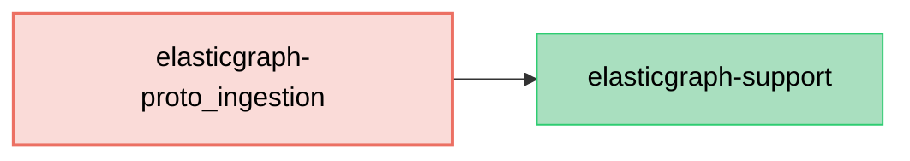

# ElasticGraph::ProtoIngestion

An ElasticGraph extension that supports ingesting Protocol Buffer data into ElasticGraph.
Currently it generates Protocol Buffers schema artifacts from ElasticGraph schemas: it emits
`proto3` by default and can emit `proto2`, and supports arbitrary file-level header lines (such
as `option` declarations).

## Dependency Diagram


```mermaid
graph LR;
    classDef targetGemStyle fill:#FADBD8,stroke:#EC7063,color:#000,stroke-width:2px;
    classDef otherEgGemStyle fill:#A9DFBF,stroke:#2ECC71,color:#000;
    classDef externalGemStyle fill:#E0EFFF,stroke:#70A1D7,color:#2980B9;
    elasticgraph-proto_ingestion["elasticgraph-proto_ingestion"];
    class elasticgraph-proto_ingestion targetGemStyle;
    elasticgraph-support["elasticgraph-support"];
    elasticgraph-proto_ingestion --> elasticgraph-support;
    class elasticgraph-support otherEgGemStyle;
```

## Usage

First, add `elasticgraph-proto_ingestion` to your `Gemfile`, alongside the other ElasticGraph gems:

```diff
diff --git a/Gemfile b/Gemfile
index 4a5ef1e..5c16c2b 100644
--- a/Gemfile
+++ b/Gemfile
@@ -8,6 +8,7 @@ gem "elasticgraph-query_registry", *elasticgraph_details

 # Can be elasticgraph-elasticsearch or elasticgraph-opensearch based on the datastore you want to use.
 gem "elasticgraph-opensearch", *elasticgraph_details
+gem "elasticgraph-proto_ingestion", *elasticgraph_details

 gem "httpx", "~> 1.3"

```

Next, update your `Rakefile` so that `ElasticGraph::ProtoIngestion::SchemaDefinition::APIExtension` is
included in the schema-definition extension modules:

```diff
diff --git a/Rakefile b/Rakefile
index 2943335..26633c3 100644
--- a/Rakefile
+++ b/Rakefile
@@ -3,5 +3,6 @@
 require "elastic_graph/json_ingestion/schema_definition/api_extension"
 require "elastic_graph/local/rake_tasks"
+require "elastic_graph/proto_ingestion/schema_definition/api_extension"
 require "elastic_graph/query_registry/rake_tasks"
 require "rspec/core/rake_task"
 require "standard/rake"
@@ -16,6 +17,7 @@ ElasticGraph::Local::RakeTasks.new(
   # Determines casing of field names. Can be either `:camelCase` or `:snake_case`.
   tasks.schema_element_name_form = :camelCase
   tasks.schema_definition_extension_modules << ElasticGraph::JSONIngestion::SchemaDefinition::APIExtension
+  tasks.schema_definition_extension_modules << ElasticGraph::ProtoIngestion::SchemaDefinition::APIExtension

   # Customizes the names of fields generated by ElasticGraph.
   tasks.schema_element_name_overrides = {
```

Adding the schema definition extension automatically enables `schema.proto` generation with the default
`elasticgraph` package. Optionally, configure a custom package name from your schema definition:

```ruby
# in config/schema/protobuf.rb

ElasticGraph.define_schema do |schema|
  schema.proto_schema_artifacts package_name: "myapp.events.v1"
end
```

After running `bundle exec rake schema_artifacts:dump`, ElasticGraph will generate a `schema.proto`
schema artifact, and will maintain a `proto_field_numbers.yaml` file alongside your schema definition.

## Schema Definition API

### Protobuf Syntax (`proto2` / `proto3`)

`proto_schema_artifacts` emits `proto3` by default. Pass `syntax: :proto2` to emit a proto2 file
instead (every field is then labeled `optional` or `repeated`). This is useful when the generated
messages need to reference proto2 types — for example, `protoc` forbids a `proto3` message from
referencing a `proto2` enum:

```ruby
# in config/schema/protobuf.rb

ElasticGraph.define_schema do |schema|
  schema.proto_schema_artifacts package_name: "myapp.events.v1", syntax: :proto2
end
```

Field numbers are unaffected by the syntax, so switching an existing schema between `proto2` and
`proto3` preserves the meaning of every field. One encoding detail does differ: `proto3` packs
repeated numeric fields by default, and `proto2` does not. ElasticGraph has no per-field option
for this, and never emits the `[packed=true]` field option that turns packing on under `proto2`.
Protobuf parsers accept both encodings for repeated numeric fields under either syntax, so data
written before a switch still decodes correctly.

### Custom Header Lines

Pass `header_lines:` an array of strings to inject file-level lines (such as `option` declarations)
verbatim, as a contiguous section immediately after the `package` declaration. This lets you set
language-specific options without the gem baking in any particular convention. Each element
renders as one line, so no element can contain a newline:

```ruby
# in config/schema/protobuf.rb

ElasticGraph.define_schema do |schema|
  schema.proto_schema_artifacts(
    package_name: "myapp.events.v1",
    header_lines: [
      %(option java_package = "com.myapp.events";),
      "option java_multiple_files = true;"
    ]
  )
end
```

produces:

```text
syntax = "proto3";

package myapp.events.v1;

option java_package = "com.myapp.events";
option java_multiple_files = true;

// ...messages...
```

### Custom Scalar Types

Built-in ElasticGraph scalar types are automatically mapped to proto scalar types.
For custom scalar types, use `protobuf` to define the proto scalar type:

```ruby
# in config/schema/email.rb

ElasticGraph.define_schema do |schema|
  schema.scalar_type "Email" do |t|
    t.mapping type: "keyword"
    t.json_schema type: "string", format: "email"
    t.protobuf type: "string"
  end
end
```

A custom scalar can also map to an externally defined proto type. Pass `import:` with the path of
the proto file that defines the type:

```ruby
# in config/schema/duration.rb

ElasticGraph.define_schema do |schema|
  schema.scalar_type "Duration" do |t|
    t.mapping type: "keyword"
    t.json_schema type: "string"
    t.protobuf type: "google.protobuf.Duration", import: "google/protobuf/duration.proto"
  end
end
```

The generated `schema.proto` then contains `import "google/protobuf/duration.proto";`. ElasticGraph
emits the import only when a generated message uses the scalar. The `import:` value must be the
path of a `.proto` file.

`field_comment:` documents the expected format on each generated field. This is useful when the
proto type is wider than the ElasticGraph type:

```ruby
# in config/schema/phone_number.rb

ElasticGraph.define_schema do |schema|
  schema.scalar_type "PhoneNumber" do |t|
    t.mapping type: "keyword"
    t.json_schema type: "string"
    t.protobuf type: "string", field_comment: "Must be an E.164 phone number."
  end
end
```

A `PhoneNumber` field then renders as:

```protobuf
// Must be an E.164 phone number.
string phone_number = 1;
```

The comment goes above the field, below the field's own doc comment, because proto compilers
attach these leading comments to the code they generate for the field. A `field_comment:` can
span multiple lines. The option is named `field_comment:` rather than `comment:` because a scalar
type has no proto representation of its own to comment on; the comment applies to each field of
that type.

### Overriding a Built-in Scalar

Use `on_built_in_types` to change the protobuf type of a built-in scalar. For example, map
`DateTime` to `string` to keep the original UTC offset of each event:

```ruby
# in config/schema/protobuf.rb

ElasticGraph.define_schema do |schema|
  schema.on_built_in_types do |type|
    type.protobuf type: "string", field_comment: "Must be formatted as an ISO 8601 timestamp." if type.name == "DateTime"
  end
end
```

Each call to `protobuf` replaces the full protobuf configuration. The override above omits
`import:`, so `schema.proto` no longer imports `google/protobuf/timestamp.proto`. An override that
omits `field_comment:` likewise drops the built-in comment.

### Sourcing Enum Values From Existing Protobuf Enums

If your project already has canonical protobuf enum definitions, you can source an enum's
generated proto values from them instead of maintaining the value list in two places. Call
`external_proto_enum` on the enum type with a proto enum class (anything exposing `.enums`).
In the examples below, this stand-in plays the role of your app's generated proto enum class:

```ruby
# in config/schema/app_protos.rb

# Stands in for a proto enum class generated by your app's protobuf tooling.
module MyApp
  module Protos
    EnumEntry = ::Data.define(:name, :number)

    # Its value names carry a prefix and include a sentinel, so it needs a transform and an
    # exclusion to line up with an ElasticGraph enum.
    class Currency
      def self.enums
        [
          EnumEntry.new(name: :CURRENCY_UNKNOWN_DO_NOT_USE, number: 0),
          EnumEntry.new(name: :CURRENCY_USD, number: 1),
          EnumEntry.new(name: :CURRENCY_CAD, number: 2)
        ]
      end
    end

    # Its value names already match the ElasticGraph enum exactly, so it can be referenced
    # directly rather than regenerated locally.
    class CurrencyCode
      def self.enums
        [
          EnumEntry.new(name: :USD, number: 1),
          EnumEntry.new(name: :CAD, number: 2)
        ]
      end
    end
  end
end
```

Optional per-source options curate and transform the sourced values:

```ruby
# in config/schema/currency.rb

ElasticGraph.define_schema do |schema|
  schema.enum_type "Currency" do |t|
    t.values "USD", "CAD"
    t.external_proto_enum MyApp::Protos::Currency,
      # Proto values to omit from the generated enum.
      exclusions: [:UNKNOWN_DO_NOT_USE],
      # Values expected in the generated enum that the proto enum lacks.
      expected_extras: [:LEGACY],
      # Optional transform applied to each proto value name.
      name_transform: ->(name) { name.sub(/\ACURRENCY_/, "") }
  end
end
```

`name_transform` runs first, and `exclusions` and `expected_extras` then apply to the
transformed names. In the example above the exclusion is therefore `UNKNOWN_DO_NOT_USE`, the
name left after the transform strips `CURRENCY_`, and not `CURRENCY_UNKNOWN_DO_NOT_USE`.

When an enum has one or more external sources, `elasticgraph-proto_ingestion` uses them
as the source of the generated enum's values. When multiple sources are registered for the
same enum, they must all resolve to the same value set.

### Referencing Existing Protobuf Types

For enums that exactly match a canonical proto enum, you can go further and reference the
existing proto type instead of generating a duplicate local enum. Pass `proto:` and `import:`
to `external_proto_enum`, and `schema.proto` will import the named file and use the external
type name directly:

```ruby
# in config/schema/currency.rb

ElasticGraph.define_schema do |schema|
  schema.enum_type "CurrencyCode" do |t|
    t.values "USD", "CAD"
    t.external_proto_enum MyApp::Protos::CurrencyCode,
      proto: "myapp.types.CurrencyCode",
      import: "myapp/types/currency_code.proto"
  end
end
```

A referenced enum must have exactly one option-free source whose values match the
ElasticGraph enum's values; transformed, curated, or multi-source enums stay generated
locally so value curation remains explicit. Note that `MyApp::Protos::Currency` from the
previous section cannot be referenced this way: its `CURRENCY_`-prefixed names only match
after a transform, and referenced enums allow no transform.

The source's enum entries must also expose `.number`. Those numbers are recorded in
`proto_field_numbers.yaml`, and must agree with any numbers already pinned there — otherwise
switching to the external type would silently reinterpret existing wire data. Recording them
also means that dropping `proto:`/`import:` later regenerates the enum locally with its
original numbers rather than renumbering it. No referenced value may use number 0, which is
reserved for the zero value this gem generates for a local enum.

## Type Mappings

The generated `schema.proto` uses these built-in scalar mappings:

| ElasticGraph Type | Protobuf Type               |
|-------------------|-----------------------------|
| `Boolean`         | `bool`                      |
| `Cursor`          | `string`                    |
| `Date`            | `string`                    |
| `DateTime`        | `google.protobuf.Timestamp` |
| `Float`           | `double`                    |
| `ID`              | `string`                    |
| `Int`             | `int32`                     |
| `JsonSafeLong`    | `int64`                     |
| `LocalTime`       | `string`                    |
| `LongString`      | `int64`                     |
| `String`          | `string`                    |
| `TimeZone`        | `string`                    |
| `Untyped`         | `string`                    |

Additionally:
- `DateTime` uses the [well-known `Timestamp` type](https://protobuf.dev/reference/protobuf/google.protobuf/#timestamp);
  `schema.proto` imports `google/protobuf/timestamp.proto` automatically. Note that a `Timestamp`
  is a UTC instant, so a publisher's original UTC offset is not preserved.
- `string`-typed temporal scalars (`Date`, `LocalTime`, `TimeZone`) are wider than the
  ElasticGraph types they carry, so generated fields of these types document the expected format
  in a comment above the field (e.g. `// Must be formatted as an ISO 8601 date, e.g. "2024-11-25".`).
  Values are validated when events are ingested, just as with JSON ingestion.
- List types become `repeated` fields.
- Lists of lists (e.g. `[[Float!]!]!`) are not supported because Protocol Buffers cannot represent
  them directly. Schema artifact generation raises an error identifying the unsupported field.
- Enum types generate `enum` definitions whose values are prefixed with the enum type name in `UPPER_SNAKE_CASE`, including a zero-valued `*_UNSPECIFIED` entry.

## Stable Field Numbers

`schema_artifacts:dump` automatically reads and writes `proto_field_numbers.yaml`,
stored alongside your schema definition (as a sibling of the file `path_to_schema`
points to). Existing numbers stay fixed even if field or enum value order changes. New fields,
`oneof` alternatives, and enum values use their type's stored `next_number`, so gaps below that
cursor are never filled:

```yaml
messages:
  Widget:
    fields:
      id: 1
      display_name: 2
    next_number: 3
```

Unlike the schema artifacts--which are safe to delete and regenerate at any time--this
file is part of your schema definition: it is an input to `schema.proto` generation.
While prototyping, you may delete it and regenerate it to reset the number assignments.
Once generated protos have been used to serialize data or consumed by another codebase,
however, you must not delete and regenerate it or the original number assignments will be
lost. Commit it to version control alongside your schema definition; `schema_artifacts:check`
reports it as out of date when your schema has changed but the file has not been dumped,
so CI will catch a forgotten dump.

The file is safe to hand-edit (e.g. when resolving a merge conflict), but it is strictly
validated: unknown keys, non-integer numbers, out-of-range numbers, and duplicate numbers
are all rejected at dump time rather than silently reassigning numbers.

Alternatives inside generated interface and union `oneof` blocks use the same stable
message-field mappings, so adding or removing a concrete subtype does not renumber the
remaining alternatives.

Removed fields and `oneof` alternatives remain in the sidecar. Their numbers are explicitly
reserved in `schema.proto`, with comments recording the prior names, while every generated
message includes a comment identifying its next field number. If a removed field or alternative
is restored under the same name, it reuses its original number and is no longer reserved.

Both `schema.proto` and the sidecar use public GraphQL field names. Index field names,
including `name_in_index` overrides, are not part of the protobuf wire schema or its
stable-numbering state.

If a field is renamed with `field.renamed_from`, `elasticgraph-proto_ingestion` reuses the
existing field number under the new public field name.

## Stable Enum Value Numbers

Enum value numbers are pinned the same way, in an `enums` section of the sidecar. Existing
values keep their numbers when other values are added or removed, new values claim the stored
`next_number`, and removed values keep their numbers reserved so they are never reused
(number `0` is always the generated `*_UNSPECIFIED` value). `schema.proto` explicitly reserves
each removed value number, includes a comment recording its prior name, and identifies the next
value number for each enum:

```yaml
enums:
  WidgetColor:
    values:
      RED: 1
      BLUE: 2
    next_number: 3
```
