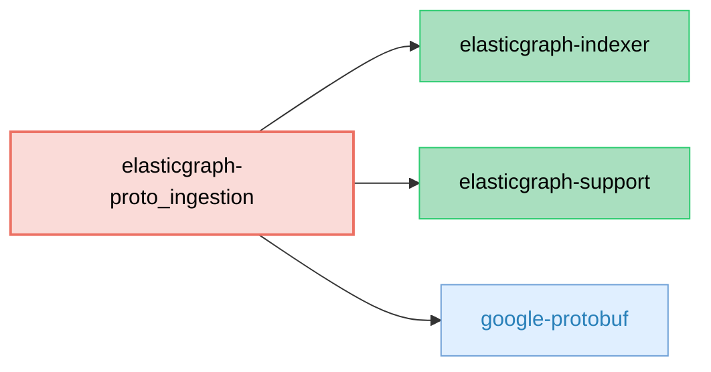

# ElasticGraph::ProtoIngestion

An ElasticGraph extension that supports ingesting Protocol Buffer data into ElasticGraph.
It generates Protocol Buffers schema artifacts from ElasticGraph schemas and decodes and validates
protobuf events for the shared indexing pipeline. It emits `proto3` by default, can emit `proto2`,
and supports arbitrary file-level header lines (such as `option` declarations).

## Dependency Diagram


```mermaid
graph LR;
    classDef targetGemStyle fill:#FADBD8,stroke:#EC7063,color:#000,stroke-width:2px;
    classDef otherEgGemStyle fill:#A9DFBF,stroke:#2ECC71,color:#000;
    classDef externalGemStyle fill:#E0EFFF,stroke:#70A1D7,color:#2980B9;
    elasticgraph-proto_ingestion["elasticgraph-proto_ingestion"];
    class elasticgraph-proto_ingestion targetGemStyle;
    elasticgraph-indexer["elasticgraph-indexer"];
    elasticgraph-proto_ingestion --> elasticgraph-indexer;
    class elasticgraph-indexer otherEgGemStyle;
    elasticgraph-support["elasticgraph-support"];
    elasticgraph-proto_ingestion --> elasticgraph-support;
    class elasticgraph-support otherEgGemStyle;
    google-protobuf["google-protobuf"];
    elasticgraph-proto_ingestion --> google-protobuf;
    class google-protobuf externalGemStyle;
    click google-protobuf href "https://rubygems.org/gems/google-protobuf" "Open on RubyGems.org" _blank;
```

## Usage

First, add `elasticgraph-proto_ingestion` to your `Gemfile`, alongside the other ElasticGraph gems:

```diff
diff --git a/Gemfile b/Gemfile
index 4a5ef1e..5c16c2b 100644
--- a/Gemfile
+++ b/Gemfile
@@ -8,6 +8,7 @@ gem "elasticgraph-query_registry", *elasticgraph_details

 # Can be elasticgraph-elasticsearch or elasticgraph-opensearch based on the datastore you want to use.
 gem "elasticgraph-opensearch", *elasticgraph_details
+gem "elasticgraph-proto_ingestion", *elasticgraph_details

 gem "httpx", "~> 1.3"

```

Next, update your `Rakefile` so that `ElasticGraph::ProtoIngestion::SchemaDefinition::APIExtension` is
included in the schema-definition extension modules:

```diff
diff --git a/Rakefile b/Rakefile
index 2943335..26633c3 100644
--- a/Rakefile
+++ b/Rakefile
@@ -3,5 +3,6 @@
 require "elastic_graph/json_ingestion/schema_definition/api_extension"
 require "elastic_graph/local/rake_tasks"
+require "elastic_graph/proto_ingestion/schema_definition/api_extension"
 require "elastic_graph/query_registry/rake_tasks"
 require "rspec/core/rake_task"
 require "standard/rake"
@@ -16,6 +17,7 @@ ElasticGraph::Local::RakeTasks.new(
   # Determines casing of field names. Can be either `:camelCase` or `:snake_case`.
   tasks.schema_element_name_form = :camelCase
   tasks.schema_definition_extension_modules << ElasticGraph::JSONIngestion::SchemaDefinition::APIExtension
+  tasks.schema_definition_extension_modules << ElasticGraph::ProtoIngestion::SchemaDefinition::APIExtension

   # Customizes the names of fields generated by ElasticGraph.
   tasks.schema_element_name_overrides = {
```

Adding the schema definition extension automatically enables `schema.proto` generation with the default
`elasticgraph` package. Optionally, configure a custom package name from your schema definition:

```ruby
# in config/schema/protobuf.rb

ElasticGraph.define_schema do |schema|
  schema.proto_schema_artifacts package_name: "myapp.events.v1"
end
```

After running `bundle exec rake schema_artifacts:dump`, ElasticGraph will generate a `schema.proto`
schema artifact, and will maintain a `proto_field_numbers.yaml` file alongside your schema definition.

## Decoding and Validation

Compile the deployed `schema.proto` into a descriptor set with imports included (`schema.pb`).
The decoder's `descriptor_set_file` configuration points to that file; its descriptors and runtime
metadata must come from the same schema dump. Publisher binaries may use older compatible contracts.

`format: envelope` (the default) accepts an `ElasticGraphEventBatch` of envelopes with operation,
ID, version, latency timestamps, and one record alternative. `format: raw` accepts a domain message
and transport metadata: `eg_op`, `eg_type`, `eg_id`, and `eg_version` by default. `metadata_fields`
can rename those transport properties. `encoding` is `binary` by default or `base64` for text transports;
protobuf JSON and text encodings are not accepted.

The decoder and registered ingestion adapter build unversioned indexing events without selecting a
JSON schema. Runtime metadata supplies only rules descriptors cannot express, such as current public
names, private index destinations, scalar validation, and known deletions. General GraphQL non-null
constraints are not enforced, but retained-wire range checks still run when record validation is sampled out.

Events naming a known deleted type are ignored in raw and envelope formats. Unknown or ambiguous
record alternatives fail rather than disappearing silently. Known messages can still contain unknown
added fields, which protobuf discards: deploy the indexer before publishers when adding fields or types.

## Schema Definition API

### Protobuf Syntax (`proto2` / `proto3`)

`proto_schema_artifacts` emits `proto3` by default. Pass `syntax: :proto2` to emit a proto2 file
instead (every field is then labeled `optional` or `repeated`). This is useful when the generated
messages need to reference proto2 types — for example, `protoc` forbids a `proto3` message from
referencing a `proto2` enum:

```ruby
# in config/schema/protobuf.rb

ElasticGraph.define_schema do |schema|
  schema.proto_schema_artifacts package_name: "myapp.events.v1", syntax: :proto2
end
```

Field numbers are unaffected by the syntax, so switching an existing schema between `proto2` and
`proto3` preserves the meaning of every field. One encoding detail does differ: `proto3` packs
repeated numeric fields by default, and `proto2` does not. ElasticGraph has no per-field option
for this, and never emits the `[packed=true]` field option that turns packing on under `proto2`.
Protobuf parsers accept both encodings for repeated numeric fields under either syntax, so data
written before a switch still decodes correctly.

### Custom Header Lines

Pass `header_lines:` an array of strings to inject file-level lines (such as `option` declarations)
verbatim, as a contiguous section immediately after the `package` declaration. This lets you set
language-specific options without the gem baking in any particular convention. Each element
renders as one line, so no element can contain a newline:

```ruby
# in config/schema/protobuf.rb

ElasticGraph.define_schema do |schema|
  schema.proto_schema_artifacts(
    package_name: "myapp.events.v1",
    header_lines: [
      %(option java_package = "com.myapp.events";),
      "option java_multiple_files = true;"
    ]
  )
end
```

produces:

```text
syntax = "proto3";

package myapp.events.v1;

option java_package = "com.myapp.events";
option java_multiple_files = true;

// ...messages...
```

### Custom Scalar Types

Built-in ElasticGraph scalar types are automatically mapped to proto scalar types.
For custom scalar types, use `protobuf` to define the proto scalar type:

```ruby
# in config/schema/email.rb

ElasticGraph.define_schema do |schema|
  schema.scalar_type "Email" do |t|
    t.mapping type: "keyword"
    t.json_schema type: "string", format: "email"
    t.protobuf type: "string"
  end
end
```

A custom scalar can also map to an externally defined proto type. Pass `import:` with the path of
the proto file that defines the type:

```ruby
# in config/schema/duration.rb

ElasticGraph.define_schema do |schema|
  schema.scalar_type "Duration" do |t|
    t.mapping type: "keyword"
    t.json_schema type: "string"
    t.protobuf type: "google.protobuf.Duration", import: "google/protobuf/duration.proto"
  end
end
```

The generated `schema.proto` then contains `import "google/protobuf/duration.proto";`. ElasticGraph
emits the import only when a generated message uses the scalar. The `import:` value must be the
path of a `.proto` file.

`field_comment:` documents the expected format on each generated field. This is useful when the
proto type is wider than the ElasticGraph type:

```ruby
# in config/schema/phone_number.rb

ElasticGraph.define_schema do |schema|
  schema.scalar_type "PhoneNumber" do |t|
    t.mapping type: "keyword"
    t.json_schema type: "string"
    t.protobuf type: "string", field_comment: "Must be an E.164 phone number."
  end
end
```

A `PhoneNumber` field then renders as:

```protobuf
// Must be an E.164 phone number.
string phone_number = 1;
```

The comment goes above the field, below the field's own doc comment, because proto compilers
attach these leading comments to the code they generate for the field. A `field_comment:` can
span multiple lines. The option is named `field_comment:` rather than `comment:` because a scalar
type has no proto representation of its own to comment on; the comment applies to each field of
that type.

### Overriding a Built-in Scalar

Use `on_built_in_types` to change the protobuf type of a built-in scalar. For example, map
`DateTime` to `string` to keep the original UTC offset of each event:

```ruby
# in config/schema/protobuf.rb

ElasticGraph.define_schema do |schema|
  schema.on_built_in_types do |type|
    type.protobuf type: "string", field_comment: "Must be formatted as an ISO 8601 timestamp." if type.name == "DateTime"
  end
end
```

Each call to `protobuf` replaces the full protobuf configuration. The override above omits
`import:`, so the scalar no longer requires `google/protobuf/timestamp.proto`. The generated event
envelope still requires that import for its latency timestamps. An override that omits
`field_comment:` likewise drops the built-in comment.

## Type Mappings

The generated `schema.proto` uses these built-in scalar mappings:

| ElasticGraph Type | Protobuf Type               |
|-------------------|-----------------------------|
| `Boolean`         | `bool`                      |
| `Cursor`          | `string`                    |
| `Date`            | `string`                    |
| `DateTime`        | `google.protobuf.Timestamp` |
| `Float`           | `double`                    |
| `ID`              | `string`                    |
| `Int`             | `int32`                     |
| `JsonSafeLong`    | `int64`                     |
| `LocalTime`       | `string`                    |
| `LongString`      | `int64`                     |
| `String`          | `string`                    |
| `TimeZone`        | `string`                    |
| `Untyped`         | `string`                    |

Additionally:
- `DateTime` uses the [well-known `Timestamp` type](https://protobuf.dev/reference/protobuf/google.protobuf/#timestamp);
  `schema.proto` imports `google/protobuf/timestamp.proto` automatically. Note that a `Timestamp`
  is a UTC instant, so a publisher's original UTC offset is not preserved.
- `string`-typed temporal scalars (`Date`, `LocalTime`, `TimeZone`) are wider than the
  ElasticGraph types they carry, so generated fields of these types document the expected format
  in a comment above the field (e.g. `// Must be formatted as an ISO 8601 date, e.g. "2024-11-25".`).
  Values are validated when events are ingested, just as with JSON ingestion.
- List types become `repeated` fields.
- Nested lists use generated wrapper messages with a repeated `values` field at each inner level.
- Singular fields use `optional` in proto2 and proto3, preserving explicit zero, false, and empty string values.
  Absent singular fields are omitted from the converted record; explicit unspecified or retired proto3 enum values become `nil`.
  The generator does not emit proto2 `required` fields. Versionless ingestion cannot distinguish an old
  publisher omitting a newly added field from a new publisher forgetting it, so GraphQL non-null (`!`)
  constraints are not enforced. Envelope ID/version are required; rollover needs its timestamp, routing
  follows the shared indexer's rules, and missing derived IDs can yield no derived operation.
- Repeated fields cannot distinguish a null list from an empty list or represent null elements. An empty wrapper represents an empty inner list.
- Enum types generate `enum` definitions whose values are prefixed with the enum type name in `UPPER_SNAKE_CASE`, including a zero-valued `*_UNSPECIFIED` entry.

## Stable Field Numbers

`schema_artifacts:dump` automatically reads and writes `proto_field_numbers.yaml`,
stored alongside your schema definition (as a sibling of the file `path_to_schema`
points to). Existing numbers stay fixed even if field or enum value order changes. New fields,
`oneof` alternatives, and enum values use their type's stored `next_number`, so gaps below that
cursor are never filled:

```yaml
messages:
  Widget:
    fields:
      id:
        field_number: 1
        proto_type: string
        list_depth: 0
      display_name:
        field_number: 2
        proto_type: string
        list_depth: 0
    next_number: 3
```

Unlike the schema artifacts--which are safe to delete and regenerate at any time--this
file is part of your schema definition: it is an input to `schema.proto` generation.
While prototyping, you may delete it and regenerate it to reset the number assignments.
Once generated protos have been used to serialize data or consumed by another codebase,
however, you must not delete and regenerate it or the original number assignments will be
lost. Commit it to version control alongside your schema definition; `schema_artifacts:check`
reports it as out of date when your schema has changed but the file has not been dumped,
so CI will catch a forgotten dump.

The file is safe to hand-edit (e.g. when resolving a merge conflict), but it is strictly
validated: unknown keys, non-integer numbers, out-of-range numbers, and duplicate numbers
are all rejected at dump time rather than silently reassigning numbers.

Alternatives inside generated interface and union `oneof` blocks use the same stable
message-field mappings, so adding or removing a concrete subtype does not renumber the
remaining alternatives.

Removed fields and `oneof` alternatives remain in the sidecar, and their numbers are reserved in
`schema.proto`. Dropping a generated field or type requires `deleted_field` or `deleted_type`;
the successful dump persists its deletion state. Restoring the compatible original can reclaim
its number, but an unrelated field cannot claim its reserved protobuf name or reinterpret its bytes.

A public rename with `field.renamed_from` retains both the number and the old protobuf name.
Type renames likewise keep the message name, its numbers, and its envelope/`oneof` alternatives.
The sidecar persists the public-to-protobuf association, so later dropping `renamed_from` does not
change the protobuf contract. Projects also using JSON must keep declarations while historical
JSON schemas still need them. Nested-list wrappers derive from stable protobuf names too.

Index field names, including `name_in_index`, are private runtime metadata, never part of the public
protobuf contract or the sidecar. Both historical JSON and protobuf events write to the current
index destination; already-indexed documents still need a backfill after a destination change.

### Type Changes and Field Rotation

The dump preserves old-publisher values rather than merely checking whether wire types can parse
one another. It permits `int32` → `int64`, `sint32` → `sint64`, and `uint32` → `uint64`, and reports
those as source-breaking changes for recompiled consumers. New values outside the old range need
upgraded downstream readers. The reverse changes retain the wider wire type; current scalar range
checks reject out-of-range values even when general record validation is sampled out.

Other type or field-shape changes require a new protobuf field name:

```ruby
# in config/schema/team.rb

ElasticGraph.define_schema do |schema|
  schema.object_type "Team" do |t|
    t.field "id", "ID!"
    t.field "wins", "String" do |f|
      f.protobuf name: "wins_str"
    end
    t.index "teams"
  end
end
```

An incompatible change with a fresh name gets a fresh number and retires the prior incarnation.
Its old number is reserved, and values from old publishers on that number are intentionally dropped.
An explicit name change with a compatible type and shape keeps the number instead: it is a
source-breaking rename, not a rotation. The dump rejects active/retired name or number collisions.

Legacy integer-only mappings seed current fields from their current definitions. Dump them before
making any type or shape changes: integer entries alone cannot prove the old contract. Already-removed
legacy fields remain tombstones without an invented type, and cannot be restored until their historical
`proto_type` and `list_depth` are supplied explicitly. Scalar types use names such as `int64`; message
and enum types use fully qualified names such as `.elasticgraph.Widget`. Do not guess or reset
production history.

## Stable Enum Value Numbers

Enum value numbers are pinned the same way, in an `enums` section of the sidecar. Existing
values keep their numbers when other values are added or removed, new values claim the stored
`next_number`, and removed values keep their numbers reserved so they are never reused
(number `0` is always the generated `*_UNSPECIFIED` value). `schema.proto` explicitly reserves
each removed value number, includes a comment recording its prior name, and identifies the next
value number for each enum. Enum types and values can use `renamed_from` to retain their protobuf names
and numbers across public renames. Known retired proto3 enum numbers convert to `nil`; genuinely unknown
numbers fail validation. The current Ruby decoder exposes these numbers under both syntaxes, including
`nil` slots in repeated fields. Other proto2 consumers may instead treat retired singular values as absent
and omit retired repeated elements:

```yaml
enums:
  WidgetColor:
    values:
      RED:
        value_number: 1
        proto_name: WIDGET_COLOR_RED
      BLUE:
        value_number: 2
        proto_name: WIDGET_COLOR_BLUE
    next_number: 3
```
