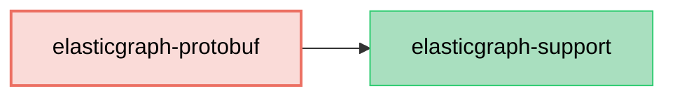

# ElasticGraph::Protobuf

An ElasticGraph extension that generates Protocol Buffers (`proto3`) schema artifacts from ElasticGraph schemas.

## Dependency Diagram



## Usage

First, add `elasticgraph-protobuf` to your `Gemfile`, alongside the other ElasticGraph gems:

```diff
diff --git a/Gemfile b/Gemfile
index 4a5ef1e..5c16c2b 100644
--- a/Gemfile
+++ b/Gemfile
@@ -8,6 +8,7 @@ gem "elasticgraph-query_registry", *elasticgraph_details

 # Can be elasticgraph-elasticsearch or elasticgraph-opensearch based on the datastore you want to use.
 gem "elasticgraph-opensearch", *elasticgraph_details
+gem "elasticgraph-protobuf", *elasticgraph_details

 gem "httpx", "~> 1.3"

```

Next, update your `Rakefile` so that `ElasticGraph::Protobuf::SchemaDefinition::APIExtension` is
included in the schema-definition extension modules:

```diff
diff --git a/Rakefile b/Rakefile
index 2943335..26633c3 100644
--- a/Rakefile
+++ b/Rakefile
@@ -1,5 +1,6 @@
 project_root = File.expand_path(__dir__)

+require "elastic_graph/protobuf/schema_definition/api_extension"
 require "elastic_graph/local/rake_tasks"
 require "elastic_graph/query_registry/rake_tasks"
 require "rspec/core/rake_task"
@@ -12,6 +13,8 @@ ElasticGraph::Local::RakeTasks.new(
   local_config_yaml: settings_file,
   path_to_schema: "#{project_root}/config/schema.rb"
 ) do |tasks|
+  tasks.schema_definition_extension_modules << ElasticGraph::Protobuf::SchemaDefinition::APIExtension
+
   # Set this to true once you're beyond the prototyping stage.
   tasks.enforce_json_schema_version = false

```

Then opt into proto generation from your schema definition:

```ruby
# in config/schema/protobuf.rb

ElasticGraph.define_schema do |schema|
  schema.proto_schema_artifacts package_name: "myapp.events.v1"
end
```

After running `bundle exec rake schema_artifacts:dump`, ElasticGraph will generate:

- `schema.proto`
- `proto_field_numbers.yaml`

## Schema Definition Options

### Custom Scalar Types

Built-in ElasticGraph scalar types are automatically mapped to proto scalar types.
For custom scalar types, the generator infers proto scalar types from `json_schema type:` when it is one
of `string`, `boolean`, `number`, or `integer`. You can override inference with `proto_field`:

```ruby
# in config/schema/money.rb

ElasticGraph.define_schema do |schema|
  schema.scalar_type "Money" do |t|
    t.mapping type: "long"
    t.json_schema type: "integer"
    t.proto_field type: "int64"
  end
end
```

### Sourcing Enum Values From Existing Protobuf Mappings

If your project already maintains GraphQL-to-proto enum mappings (for example in tests),
you can reuse them for proto schema generation:

```ruby
# in config/schema/proto_enum_mappings.rb

ElasticGraph.define_schema do |schema|
  schema.proto_enum_mappings(
    SalesEg::ProtoEnumMappings::PROTO_ENUMS_BY_GRAPHQL_ENUM
  ) if defined?(SalesEg::ProtoEnumMappings)
end
```

When a mapping exists for an enum, `elasticgraph-protobuf` uses the mapped proto enum(s)
as the source of enum values (respecting `exclusions`, `expected_extras`, and `name_transform`).

### Stable Field Numbers

`schema_artifacts:dump` automatically reads and writes `proto_field_numbers.yaml`
in the schema artifacts directory. Existing numbers stay fixed even if field order
changes, and new fields get the next available numbers.

`schema.proto` always uses the public GraphQL field names. When a field uses a
different `name_in_index`, the sidecar YAML stores that override privately:

```yaml
messages:
  Widget:
    fields:
      id: 1
      display_name:
        field_number: 2
        name_in_index: displayName
```

If a field is renamed with `field.renamed_from`, `elasticgraph-protobuf` reuses the
existing field number under the new public field name.

## Type Mappings

The generated `schema.proto` uses these built-in scalar mappings:

| ElasticGraph Type | Protobuf Type |
|-------------------|------------|
| `Boolean`         | `bool`     |
| `Cursor`          | `string`   |
| `Date`            | `string`   |
| `DateTime`        | `string`   |
| `Float`           | `double`   |
| `ID`              | `string`   |
| `Int`             | `int32`    |
| `JsonSafeLong`    | `int64`    |
| `LocalTime`       | `string`   |
| `LongString`      | `int64`    |
| `String`          | `string`   |
| `TimeZone`        | `string`   |
| `Untyped`         | `string`   |

Additionally:
- List types become `repeated` fields.
- Nested list types generate wrapper messages so the output remains valid `proto3`.
- Enum types generate `enum` definitions whose values are prefixed with the enum type name in `UPPER_SNAKE_CASE`, including a zero-valued `*_UNSPECIFIED` entry.
