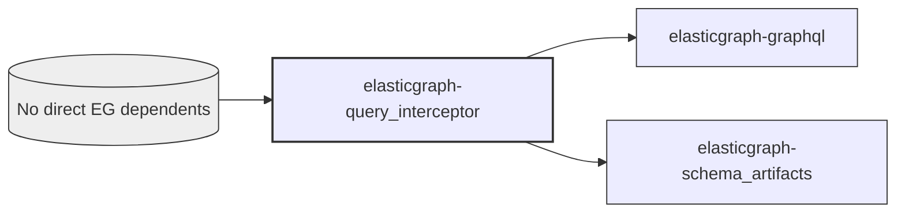

# ElasticGraph::QueryInterceptor

An ElasticGraph extension library that lets you intercept datastore
queries before they are submitted in order to customize/modify them some
how.

## Dependency Diagram



## Setup

First, add `elasticgraph-query_interceptor` to your `Gemfile`:

``` ruby
gem "elasticgraph-query_interceptor"
```

Next, configure this library in your ElasticGraph config YAML files.
An optional "config" dictionary can be provided to pass in values to
your interceptor when it is initialized.

``` yaml
extension_modules:
- require_path: elastic_graph/query_interceptor/graphql_extension
  name: ElasticGraph::QueryInterceptor::GraphQLExtension
query_interceptor:
  interceptors:
  - require_path: ./my_app/example_interceptor
    name: MyApp::ExampleInterceptor
    config: # Optional
      foo: bar
```

Define your interceptors at the configured paths. Each interceptor must
implement this interface:

``` ruby
module YourApp
  class ExampleInterceptor
    def initialize(elasticgraph_graphql:, config:)
      # elasticgraph_graphql is the `ElasticGraph::GraphQL` instance and has access
      # to things like the datastore client in case you need it in your interceptor.
    end

    def intercept(query, field:, args:, http_request:, context:)
      # Call `query.merge_with(...)` as desired to merge in query overrides like filters.
      # This method must return a query.
    end
  end
end
```
