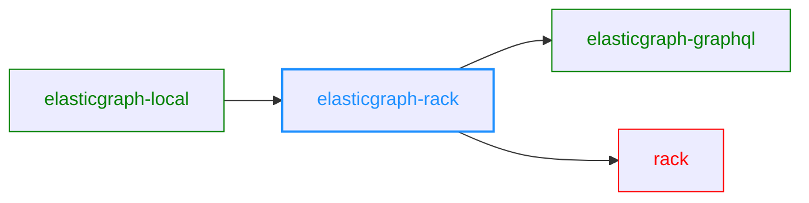

# ElasticGraph::Rack

Uses [Rack](https://github.com/rack/rack) to serve an ElasticGraph application.
Intended primarily to make it easy to boot ElasticGraph applications locally,
but could also be used to serve an ElasticGraph application from any Rack
compatible web server.

## Dependency Diagram



## Serving an ElasticGraph GraphQL Endpoint

`ElasticGraph::Rack::GraphQLEndpoint` is a Rack application. Here's an
example of using it in a Rack `config.ru` file:

```ruby
require 'elastic_graph/graphql'
require 'elastic_graph/rack/graphql_endpoint'

graphql = ElasticGraph::GraphQL.from_yaml_file("path/to/config.yaml")
run ElasticGraph::Rack::GraphQLEndpoint.new(graphql)
```

Run this with `rackup` (after installing the `rackup` gem) or any other rack-compatible server.

## Serving a GraphiQL UI

This gem also provides a simple GraphiQL UI using the CDN-hosted GraphiQL assets.
Here's an example `config.ru` to boot that:

``` ruby
require 'elastic_graph/graphql'
require 'elastic_graph/rack/graphiql'

graphql = ElasticGraph::GraphQL.from_yaml_file("path/to/config.yaml")
run ElasticGraph::Rack::GraphiQL.new(graphql)
```

Run this with `rackup` (after installing the `rackup` gem) or any other rack-compatible server.

## License

elasticgraph-rack is released under the [MIT License](https://opensource.org/licenses/MIT).

[Part of the distributed code](lib/elastic_graph/rack/graphiql/index.html)
comes from the [GraphiQL project](https://github.com/graphql/graphiql), also licensed under the
MIT License, Copyright (c) GraphQL Contributors.
