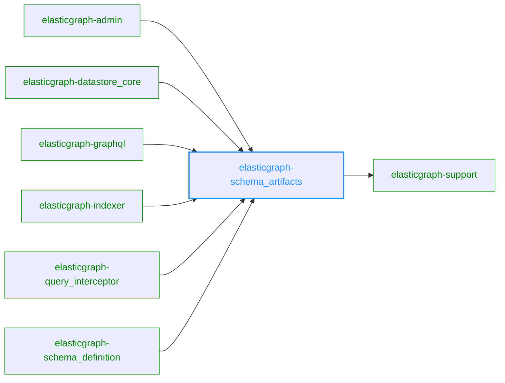

# ElasticGraph::SchemaArtifacts

Contains code related to ElasticGraph's generated schema artifacts.

## Dependency Diagram

```mermaid
graph LR;
    elasticgraph-schema_artifacts["elasticgraph-schema_artifacts"];
    elasticgraph-support["elasticgraph-support"];
    elasticgraph-schema_artifacts --> elasticgraph-support;
    elasticgraph-admin["elasticgraph-admin"];
    elasticgraph-admin --> elasticgraph-schema_artifacts;
    elasticgraph-datastore_core["elasticgraph-datastore_core"];
    elasticgraph-datastore_core --> elasticgraph-schema_artifacts;
    elasticgraph-graphql["elasticgraph-graphql"];
    elasticgraph-graphql --> elasticgraph-schema_artifacts;
    elasticgraph-indexer["elasticgraph-indexer"];
    elasticgraph-indexer --> elasticgraph-schema_artifacts;
    elasticgraph-query_interceptor["elasticgraph-query_interceptor"];
    elasticgraph-query_interceptor --> elasticgraph-schema_artifacts;
    elasticgraph-schema_definition["elasticgraph-schema_definition"];
    elasticgraph-schema_definition --> elasticgraph-schema_artifacts;
    style elasticgraph-schema_artifacts color:DodgerBlue,stroke-width:2px,stroke:DodgerBlue;
    style elasticgraph-support color:Green,stroke:Green;
    style elasticgraph-admin color:Green,stroke:Green;
    style elasticgraph-datastore_core color:Green,stroke:Green;
    style elasticgraph-graphql color:Green,stroke:Green;
    style elasticgraph-indexer color:Green,stroke:Green;
    style elasticgraph-query_interceptor color:Green,stroke:Green;
    style elasticgraph-schema_definition color:Green,stroke:Green;
```
