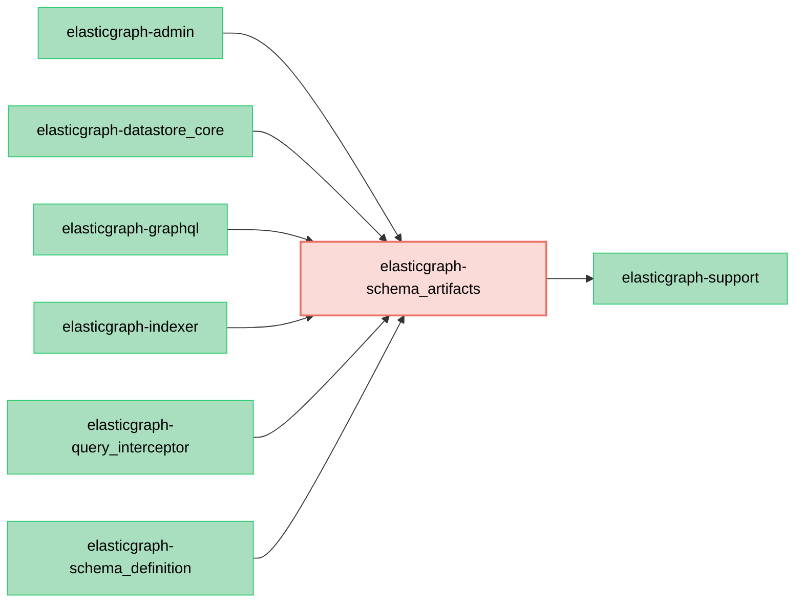

# ElasticGraph::SchemaArtifacts

Contains code related to ElasticGraph's generated schema artifacts.

## Dependency Diagram



## Usage

`elasticgraph-schema_artifacts` is used internally by the other parts of ElasticGraph, but it can also be used directly:

```ruby
require "elastic_graph/schema_artifacts"

artifacts = ElasticGraph::SchemaArtifacts.from_yaml_file("config/settings/local.yaml")

# The `artifacts` object provides access to the various schema artifacts:
artifacts.graphql_schema_string
artifacts.datastore_config
artifacts.runtime_metadata
# JSON methods belong to the JSON ingestion extension's provider:
json = artifacts.extension_artifacts.fetch("json")
json.json_schemas_for(json.latest_json_schema_version)
```

## Extension-owned artifacts

`FromDisk` and in-memory `SchemaDefinition::Results` expose the same `extension_artifacts` registry. An extension owns its provider's methods: JSON supplies versioned JSON schemas, protobuf supplies `proto_schema`, and a third-party gem can supply an unrelated API. Core does not enumerate supported formats.

Register a provider factory with `schema.register_schema_artifact_extension(name, factory, defined_at:, **config)`. The factory must define both `from_disk(artifacts_dir, config:)` and `from_schema_definition(results, config:)`. Each returns a provider implementing the extension's own interface. Use the existing schema artifact manager extension hook to dump the provider's files.

Registrations, require paths, and configuration are saved in runtime metadata. `extension_artifacts.key?(name)` checks registration without loading the provider. `extension_artifacts.fetch(name)` loads and caches it for that artifact instance, or raises `MissingSchemaArtifactError` if it is unregistered. Each application needs the gems for the providers it accesses; other registered providers remain unloaded.

After enabling or changing an artifact extension, regenerate schema artifacts. Callers that previously accessed JSON methods directly on `FromDisk` or `Results` must now access the `json` provider, as shown above. The core artifact interface and type signatures contain no JSON or protobuf methods.
