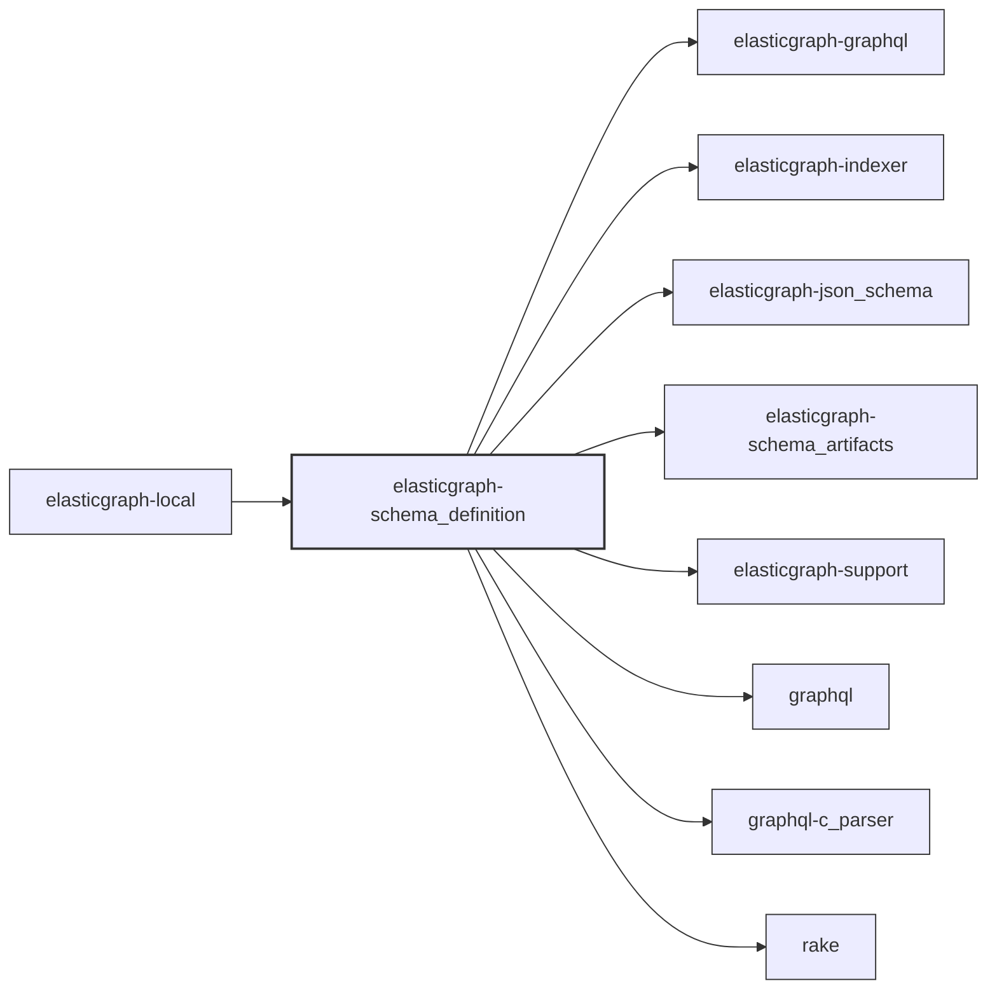

# ElasticGraph::SchemaDefinition

Provides the ElasticGraph schema definition API, which is used to
generate ElasticGraph's schema artifacts.

This gem is not intended to be used in production--production should
just use the schema artifacts instead.

## Dependency Diagram

