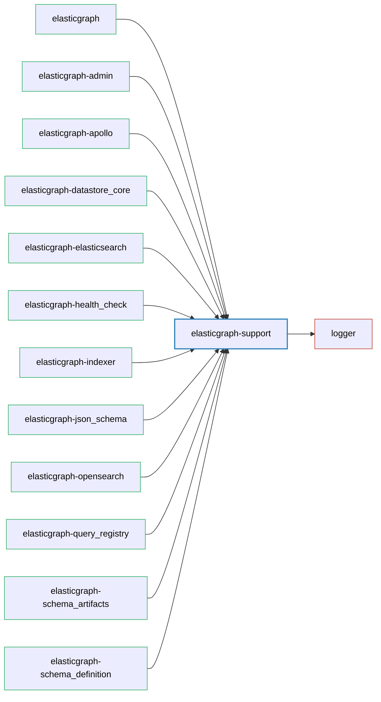

# ElasticGraph::Support

This gem provides support utilities for the rest of the ElasticGraph gems. As
such, it is not intended to provide any public APIs for ElasticGraph users.

Importantly, it is intended to have as few dependencies as possible: it currently
only depends on `logger` (which originated in the Ruby standard library).

## Dependency Diagram

