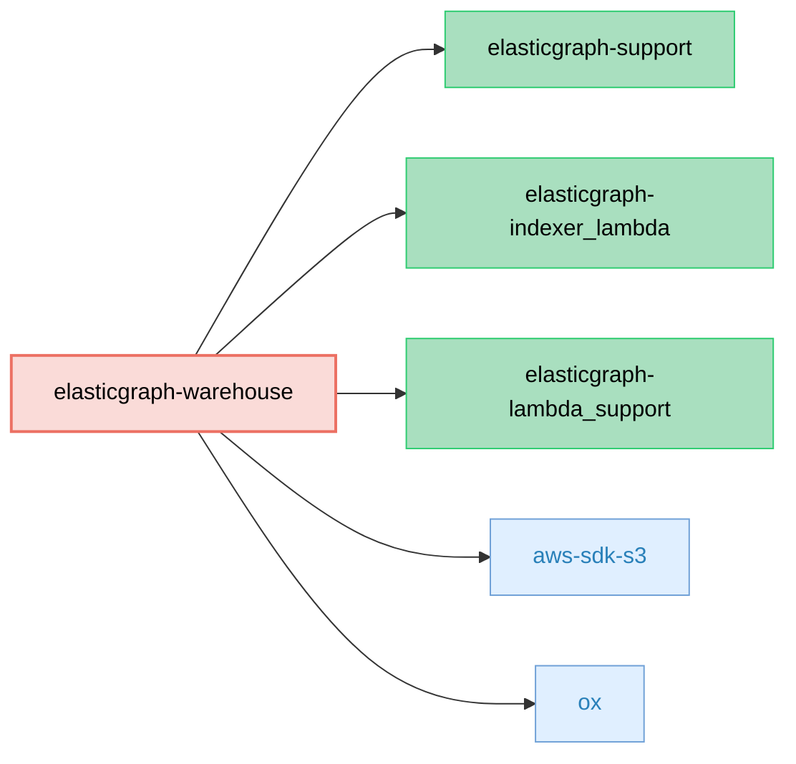

# ElasticGraph::Warehouse

> **_NOTE:_** This gem is still a WIP functionality mentioned in this readme may not yet be implemented.

An ElasticGraph extension that generates Data Warehouse table configurations from ElasticGraph schemas
and provides an AWS Lambda for writing ElasticGraph-shaped JSONL files to S3.

This extension enables seamless integration with data warehouse systems like Apache Hive, AWS Athena,
and similar SQL-based analytical platforms by automatically generating DDL and configuration files,
as well as providing a Lambda function to export data directly to S3 in a warehouse-compatible format.

## Dependency Diagram



## Setup

First, add `elasticgraph-warehouse` to your `Gemfile`, alongside the other ElasticGraph gems:

```diff
diff --git a/Gemfile b/Gemfile
index 4a5ef1e..5c16c2b 100644
--- a/Gemfile
+++ b/Gemfile
@@ -8,6 +8,7 @@ gem "elasticgraph-query_registry", *elasticgraph_details

 # Can be elasticgraph-elasticsearch or elasticgraph-opensearch based on the datastore you want to use.
 gem "elasticgraph-opensearch", *elasticgraph_details
+gem "elasticgraph-warehouse", *elasticgraph_details

 gem "httpx", "~> 1.3"

```

## AWS Lambda Integration

This gem includes an AWS Lambda function that writes ElasticGraph-shaped JSONL files to S3, allowing
you to feed your data warehouse directly from ElasticGraph indexing events.

### What the Lambda Does

- Consumes ElasticGraph indexing operations and groups them by GraphQL type
- Transforms each operation into a flattened JSON document that matches your ElasticGraph schema
- Writes one gzipped JSONL file per type per batch to S3 with deterministic keys:
  - `s3://<bucket>/dumped-data/<s3_path_prefix>/<TypeName>/v<json_schema_version>/<YYYY-MM-DD>/<uuid>.jsonl.gz`
- Emits structured logs for observability (counts, sizes, S3 key, etc.)

### Configuration

Configuration is sourced from your normal ElasticGraph YAML settings and environment variables used in Lambda.

**YAML Configuration (via `ELASTICGRAPH_YAML_CONFIG`):**

```yaml
warehouse:
  s3_path_prefix: Data001  # Prefix for S3 keys under dumped-data/
```

**Environment Variables:**

- `DATAWAREHOUSE_S3_BUCKET_NAME`: The S3 bucket name to write JSONL files into (required)
- `REPORT_BATCH_ITEM_FAILURES`: Set to `"true"` to enable SQS partial batch failure responses (optional)

### Lambda Handler

This gem exposes a handler constant for AWS Lambda:

```ruby
# elastic_graph/warehouse/lambda/lambda_function.rb
ElasticGraphWarehouse = ElasticGraph::Warehouse::Lambda::LambdaFunction.new
```

Deploy your Lambda with that handler entry. The function consumes SQS events in the
same format as `elasticgraph-indexer_lambda` and writes JSONL to S3.

### S3 Key Format

Files are written with the following S3 key format:

```
dumped-data/<s3_path_prefix>/<TypeName>/v<json_schema_version>/<YYYY-MM-DD>/<uuid>.jsonl.gz
```

- `s3_path_prefix`: Configurable in YAML (`warehouse.s3_path_prefix`)
- `TypeName`: GraphQL type from the ElasticGraph event
- `json_schema_version`: The latest JSON Schema version available to the Indexer
- `YYYY-MM-DD`: UTC date when the batch was processed
- `uuid`: A random UUID for uniqueness

### Observability

The Lambda logs structured events:

- `WarehouseLambdaReceivedBatch`: counts per type for incoming batch
- `DumpedToWarehouseFile`: S3 key, type, record_count, json_size, gzip_size

## Local Development

Run the gem's unit tests:

```bash
bundle exec rspec elasticgraph-warehouse/spec
```

## License

MIT
