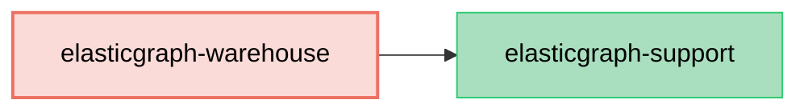

# ElasticGraph::Warehouse

An ElasticGraph extension that generates Data Warehouse table configurations from ElasticGraph schemas.

This extension enables seamless integration with data warehouse systems like Apache Hive, AWS Athena,
and similar SQL-based analytical platforms by automatically generating DDL and configuration files.

## Dependency Diagram



## Usage

First, add `elasticgraph-warehouse` to your `Gemfile`, alongside the other ElasticGraph gems:

```diff
diff --git a/Gemfile b/Gemfile
index 4a5ef1e..5c16c2b 100644
--- a/Gemfile
+++ b/Gemfile
@@ -8,6 +8,7 @@ gem "elasticgraph-query_registry", *elasticgraph_details

 # Can be elasticgraph-elasticsearch or elasticgraph-opensearch based on the datastore you want to use.
 gem "elasticgraph-opensearch", *elasticgraph_details
+gem "elasticgraph-warehouse", *elasticgraph_details

 gem "httpx", "~> 1.3"

```

Next, update your `Rakefile` so that `ElasticGraph::Warehouse::SchemaDefinition::APIExtension` is
used as one of the `schema_definition_extension_modules`:

```diff
diff --git a/Rakefile b/Rakefile
index 2943335..26633c3 100644
--- a/Rakefile
+++ b/Rakefile
@@ -1,5 +1,6 @@
 project_root = File.expand_path(__dir__)

+require "elastic_graph/warehouse/schema_definition/api_extension"
 require "elastic_graph/local/rake_tasks"
 require "elastic_graph/query_registry/rake_tasks"
 require "rspec/core/rake_task"
@@ -12,6 +13,8 @@ ElasticGraph::Local::RakeTasks.new(
   local_config_yaml: settings_file,
   path_to_schema: "#{project_root}/config/schema.rb"
 ) do |tasks|
+  tasks.schema_definition_extension_modules = [ElasticGraph::Warehouse::SchemaDefinition::APIExtension]
+
   # Set this to true once you're beyond the prototyping stage.
   tasks.enforce_json_schema_version = false

```

After running `bundle exec rake schema_artifacts:dump`, a `data_warehouse.yaml` file will be
generated containing SQL `CREATE TABLE` statements for each indexed type.

## Schema Definition Options

### Custom Table Names

By default, warehouse tables use the same name as the index. You can customize the table name
using the `warehouse_table` method:

```ruby
# in config/schema/widget.rb

ElasticGraph.define_schema do |schema|
  schema.object_type "Widget" do |t|
    t.field "id", "ID"
    t.field "name", "String"

    t.index "widgets" do |i|
      i.warehouse_table "widget_records" # Customize the warehouse table name
    end
  end
end
```

### Custom Scalar Types

Built-in ElasticGraph scalar types are automatically mapped to appropriate warehouse column types.
For custom scalar types, you must specify the warehouse column type:

```ruby
# in config/schema/money.rb

ElasticGraph.define_schema do |schema|
  schema.scalar_type "Money" do |t|
    t.mapping type: "long"
    t.json_schema type: "integer"
    t.warehouse_column type: "BIGINT"
  end
end
```

## Type Mappings

The extension automatically converts ElasticGraph types to warehouse column types:

| ElasticGraph Type | Warehouse Type |
|-------------------|----------------|
| `Boolean`         | `BOOLEAN`      |
| `Cursor`          | `STRING`       |
| `Date`            | `DATE`         |
| `DateTime`        | `TIMESTAMP`    |
| `Float`           | `FLOAT`        |
| `ID`              | `STRING`       |
| `Int`             | `INT`          |
| `JsonSafeLong`    | `BIGINT`       |
| `LocalTime`       | `STRING`       |
| `LongString`      | `BIGINT`       |
| `String`          | `STRING`       |
| `TimeZone`        | `STRING`       |
| `Untyped`         | `STRING`       |

Additionally:
- List types become `ARRAY<type>` (e.g., `[String!]!` becomes `ARRAY<STRING>`)
- Object types become `STRUCT<field1 type1, field2 type2, ...>`
- Nested arrays are supported (e.g., `[[Int!]!]!` becomes `ARRAY<ARRAY<INT>>`)
