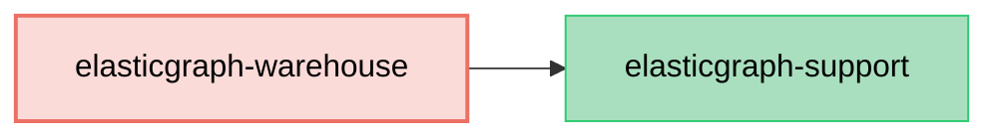

# ElasticGraph::Warehouse

> **_NOTE:_** This gem is still a WIP functionality mentioned in this readme may not yet be implemented. 

An ElasticGraph extension that generates Data Warehouse table configurations from ElasticGraph schemas.

This extension enables seamless integration with data warehouse systems like Apache Hive, AWS Athena,
and similar SQL-based analytical platforms by automatically generating DDL and configuration files.

## Dependency Diagram



## Setup

First, add `elasticgraph-warehouse` to your `Gemfile`, alongside the other ElasticGraph gems:

```diff
diff --git a/Gemfile b/Gemfile
index 4a5ef1e..5c16c2b 100644
--- a/Gemfile
+++ b/Gemfile
@@ -8,6 +8,7 @@ gem "elasticgraph-query_registry", *elasticgraph_details

 # Can be elasticgraph-elasticsearch or elasticgraph-opensearch based on the datastore you want to use.
 gem "elasticgraph-opensearch", *elasticgraph_details
+gem "elasticgraph-warehouse", *elasticgraph_details

 gem "httpx", "~> 1.3"

```

TODO: Finish
