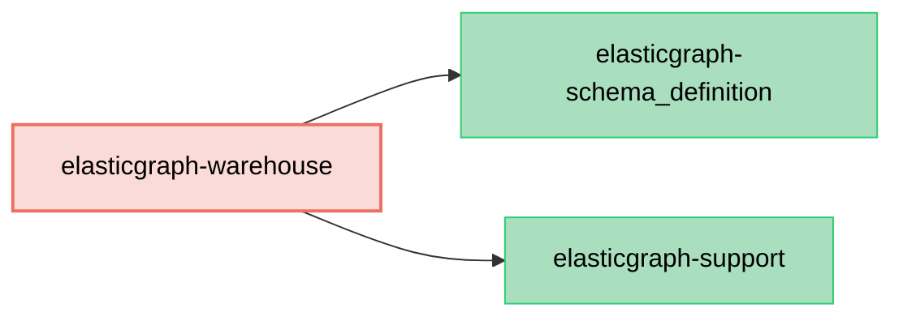

# ElasticGraph::Warehouse

An ElasticGraph extension that generates Data Warehouse table configurations from ElasticGraph schemas.

This extension enables seamless integration with data warehouse systems like Apache Hive, AWS Athena,
and similar SQL-based analytical platforms by automatically generating DDL and configuration files.

## Dependency Diagram


```mermaid
graph LR;
    classDef targetGemStyle fill:#FADBD8,stroke:#EC7063,color:#000,stroke-width:2px;
    classDef otherEgGemStyle fill:#A9DFBF,stroke:#2ECC71,color:#000;
    classDef externalGemStyle fill:#E0EFFF,stroke:#70A1D7,color:#2980B9;
    elasticgraph-warehouse["elasticgraph-warehouse"];
    class elasticgraph-warehouse targetGemStyle;
    elasticgraph-schema_definition["elasticgraph-schema_definition"];
    elasticgraph-warehouse --> elasticgraph-schema_definition;
    class elasticgraph-schema_definition otherEgGemStyle;
    elasticgraph-support["elasticgraph-support"];
    elasticgraph-warehouse --> elasticgraph-support;
    class elasticgraph-support otherEgGemStyle;
```

## Setup

First, add `elasticgraph-warehouse` to your `Gemfile`, alongside the other ElasticGraph gems:

```diff
diff --git a/Gemfile b/Gemfile
index 4a5ef1e..5c16c2b 100644
--- a/Gemfile
+++ b/Gemfile
@@ -8,6 +8,7 @@ gem "elasticgraph-query_registry", *elasticgraph_details

 # Can be elasticgraph-elasticsearch or elasticgraph-opensearch based on the datastore you want to use.
 gem "elasticgraph-opensearch", *elasticgraph_details
+gem "elasticgraph-warehouse", *elasticgraph_details

 gem "httpx", "~> 1.3"

```

Next, update your `Rakefile` so that `ElasticGraph::Warehouse::SchemaDefinition::APIExtension` is
used as one of the `extension_modules`:

```diff
diff --git a/Rakefile b/Rakefile
index 2943335..26633c3 100644
--- a/Rakefile
+++ b/Rakefile
@@ -1,5 +1,6 @@
 project_root = File.expand_path(__dir__)

+require "elastic_graph/warehouse/schema_definition/api_extension"
 require "elastic_graph/local/rake_tasks"
 require "elastic_graph/query_registry/rake_tasks"
 require "rspec/core/rake_task"
@@ -12,6 +13,8 @@ ElasticGraph::Local::RakeTasks.new(
   local_config_yaml: settings_file,
   path_to_schema: "#{project_root}/config/schema.rb"
 ) do |tasks|
+  tasks.schema_definition_extension_modules = [ElasticGraph::Warehouse::SchemaDefinition::APIExtension]
+
   # Set this to true once you're beyond the prototyping stage.
   tasks.enforce_json_schema_version = false

```

Finally, define warehouse tables in your schema:

```ruby
# in config/schema/order.rb

ElasticGraph.define_schema do |schema|
  schema.object_type "Order" do |t|
    t.field "id", "ID"
    t.field "totalAmount", "Float"
    t.field "createdAt", "DateTime"

    # Define a warehouse table for this type
    t.warehouse_table "orders"

    t.index "orders"
  end
end
```

That's it! When you run `rake schema_artifacts:dump`, a `data_warehouse.yaml` file will be generated
alongside your other schema artifacts.

## Usage

### Defining Warehouse Tables

The warehouse extension adds a `warehouse_table` method to object and interface types:

```ruby
ElasticGraph.define_schema do |schema|
  schema.object_type "Person" do |t|
    t.field "id", "ID"
    t.field "name", "String"
    t.field "age", "Int"

    # Define a warehouse table for this type
    t.warehouse_table "person", retention_days: 90
  end
end
```

### Configuring Scalar Column Types

You can configure warehouse column types for custom scalar types:

```ruby
ElasticGraph.define_schema do |schema|
  schema.scalar_type "MyDateTime" do |t|
    t.mapping type: "date", format: ElasticGraph::DATASTORE_DATE_TIME_FORMAT
    t.json_schema type: "string", format: "date-time"

    # Configure warehouse column type
    t.warehouse_column type: "TIMESTAMP"
  end
end
```

## Generated Artifacts

When you run `rake schema_artifacts:dump`, the extension generates a `data_warehouse.yaml` file
in your artifacts directory (typically `config/schema/artifacts/`). The file contains warehouse
table configurations keyed by table name:

```yaml
orders:
  settings:
    retention_days: 90
  table_schema: |
    CREATE TABLE IF NOT EXISTS orders (
      id STRING,
      totalAmount DOUBLE,
      createdAt TIMESTAMP,
      customer STRUCT<id STRING, name STRING>,
      items ARRAY<STRUCT<sku STRING, quantity INT>>
    )
```

The `table_schema` contains a complete SQL DDL statement that can be executed directly in SQL-based
warehouse systems like Hive, Athena, or Presto. The schema is automatically derived from your
ElasticGraph type definitions, including nested objects as `STRUCT` types and arrays as `ARRAY` types.
