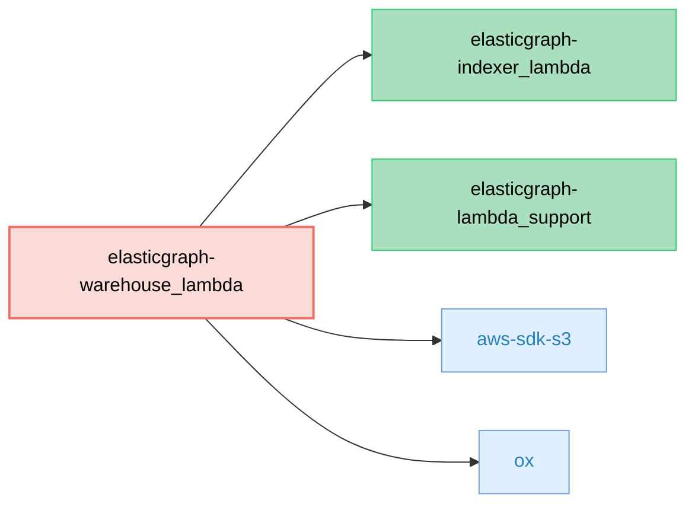

# ElasticGraph::WarehouseLambda

Write ElasticGraph-shaped JSONL files to S3, packaged for AWS Lambda.

This gem adapts ElasticGraph's indexing pipeline so that, instead of writing to the datastore,
it writes batched, gzipped [JSON Lines](https://jsonlines.org/) (JSONL) files to Amazon S3. Each line in the file
conforms to a specific JSON Schema version for the corresponding object type, with files partitioned by schema version.

**Note:** This code does not deduplicate when writing to S3, so the data will contain all events
and versions published, plus any Lambda retries. Consumers of the S3 bucket are responsible for
deduplicating records by version when loading data into a warehouse.

## Dependency Diagram



## What it does

- Consumes ElasticGraph indexing operations and groups them by GraphQL type and JSON schema version
- Transforms each operation into a flattened JSON document that matches your ElasticGraph schema
- Writes one gzipped JSONL file per type per JSON schema version per batch to S3 with deterministic keys:
  - `s3://<bucket>/<s3_path_prefix>/<TypeName>/v<json_schema_version>/<YYYY-MM-DD>/<uuid>.jsonl.gz`
- Emits structured logs for observability (counts, sizes, S3 key, etc.)

## When to use it

Use this when you need a durable, append-only export of ElasticGraph data suitable for ingestion
by downstream systems (e.g., data warehouses, lakehouses, or offline analytics pipelines). It's a
drop-in replacement for the Indexer's datastore router: instead of indexing into the datastore,
you persist JSONL to S3.

This is particularly useful when you want to pair a full-fledged SQL-based data warehouse
(such as Databricks) with ElasticGraph. Managing the warehouse via ElasticGraph ensures
that the schema and data in the warehouse exactly matches what's exposed from your
ElasticGraph GraphQL API, so that clients can seamlessly switch between GraphQL and SQL.

## Configuration

Configuration is sourced from your normal ElasticGraph YAML settings (via ELASTICGRAPH_YAML_CONFIG).

```yaml
warehouse:
  s3_path_prefix: dumped-data/Data001 # Required: full S3 key prefix for organizing exports
  s3_bucket_name: my-bucket-name      # Required: the S3 bucket to write JSONL files into
  aws_region: us-west-2               # Optional: AWS region for S3 bucket (defaults to AWS SDK region resolution)
```

## Key format

Files are written with the following S3 key format:

```
<s3_path_prefix>/<TypeName>/v<json_schema_version>/<YYYY-MM-DD>/<uuid>.jsonl.gz
```

- **s3_path_prefix**: Configurable in YAML (warehouse.s3_path_prefix). This is the full prefix you control,
  so you can organize your data however you like (e.g., "dumped-data/Data001" or "prod/analytics/v2").
- **TypeName**: GraphQL type from the ElasticGraph event
- **json_schema_version**: The JSON Schema version **selected based on the ingested event's requested version**
  (or the closest available version if the exact version isn't available). This ensures data partitioning
  matches the actual schema version used to process each event, making it easier to handle schema evolution
  and version-specific data processing.
- **YYYY-MM-DD**: UTC date when the batch was processed (aligns with common data warehouse
  partitioning strategies)
- **uuid**: A random UUID for uniqueness

## Runtime and deps

- Runs in AWS Lambda via elasticgraph-lambda_support
- Depends on elasticgraph-indexer_lambda for event preparation and schema artifacts
- Uses aws-sdk-s3 to write to S3

## Observability

The Lambda logs structured events:
- WarehouseLambdaReceivedBatch: counts per type for incoming batch
- DumpedToWarehouseFile: S3 key, type, record_count, json_size, gzip_size

## License

MIT © Block, Inc.
