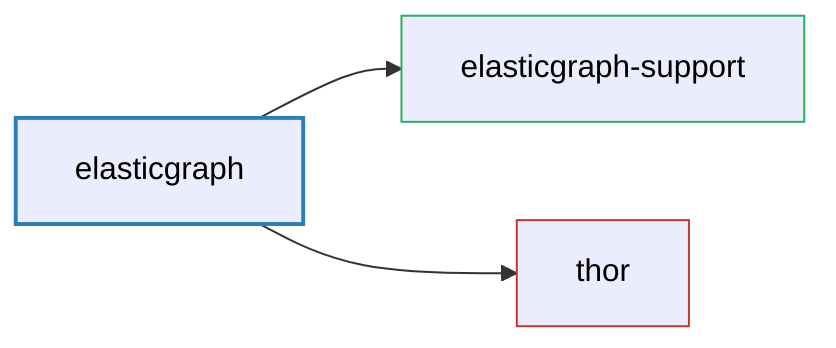

# ElasticGraph

ElasticGraph meta-gem that pulls in all the core ElasticGraph gems. Intended for use when all
parts of ElasticGraph are used from the same deployed app.

## Dependency Diagram



## Getting Started

Run this command to bootstrap a new local project:

```bash
elasticgraph new my_app
```
